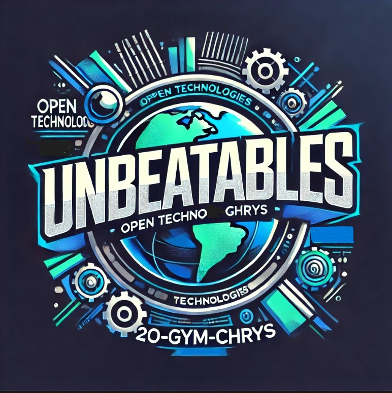
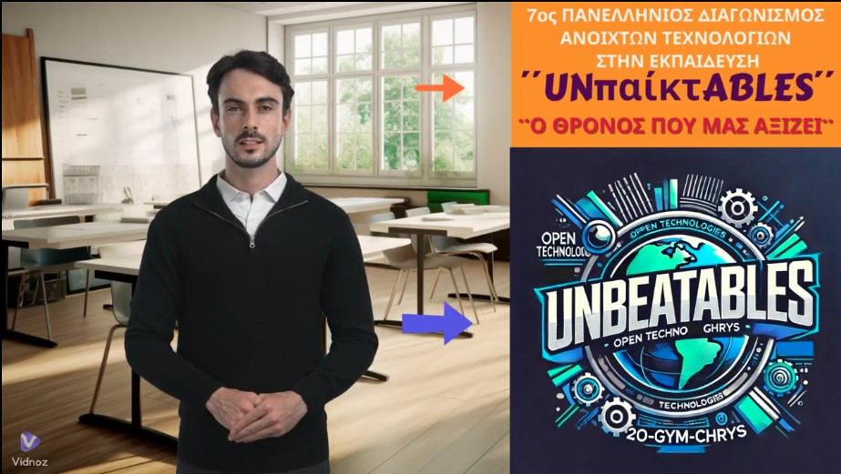

Η ομαδάρα μας ονομάζεται **"UNπαίκτABLES"**

και, επειδή το **"άπαιχτοι"** δεν μπορεί να μεταφραστεί ακριβώς στα αγγλικά, στο λογότυπο μας χρησιμοποιούμε το **"UNBEATABLES"**.
Ο τίτλος του πρότζεκτ μας είναι:

**"Ο ΘΡΟΝΟΣ ΠΟΥ ΜΑΣ ΑΞΙΖΕΙ"**

Η ομάδα μας, οι **¨UNπαικτΑBLES"** ετοίμασε 13 προτάσεις μας για τη συμμετοχή μας στον 7ο Πανελλήνιο Διαγωνισμό Ανοιχτών Τεχνολογιών στην Εκπαίδευση

-----------
**Περίληψη Έργου** 

Η ομάδα μας, οι ¨UNπαίκτΑBLES ετοίμασε ούτε μία ,ούτε δύο αλλά 13 προτάσεις για τη συμμετοχή μας στον 7ο Πανελλήνιο Διαγωνισμό Ανοιχτών Τεχνολογιών στην Εκπαίδευση.
Χωριστήκαμε σε ομάδες, κάναμε τις έρευνές μας, βάλαμε τη φαντασία μας να δουλέψει για να δημιουργήσουμε την UNπαίκτABLE δημόσια τουαλέτα για το δημόσιο χώρο, για το σχολείο, για το πάρκο. Μια τουαλέτα που είναι σε θέση να εξασφαλίζει υγιεινή, βιωσιμότητα και να είναι ευχάριστη. Που θα μπορεί να ανταποκρίνεται στις ανάγκες των παιδιών, ΑΜΕΑ ή ομάδων με διαφορετική ταυτότητα. Μία τουαλέτα που θα μπορεί να είναι ένα παιχνίδι και ταυτόχρονα ένας χώρος κοινότητας, σεβασμού και ασφάλειας. Θέλαμε να σχεδιάσουμε μια δημόσια τουαλέτα που να είναι όχι μόνο λειτουργική αλλά και αισθητικά ευχάριστη. Μια τουαλέτα που να ενθαρρύνει τη χρήση της και να συμβάλλει στην αλλαγή της αντίληψης για τους δημόσιους χώρους υγιεινής. Προσπαθήσαμε με τις ιδέες μας να εξασφαλίσουμε την υγιεινή και τη βιωσιμότητα , χρησιμοποιώντας τεχνολογίες αιχμής και φιλικά προς το περιβάλλον υλικά. Να την κάνουμε προσβάσιμη σε όλους, ανεξαρτήτως ηλικίας, φύλου ή φυσικής κατάστασης. Να την μετατρέψουμε σε έναν χώρο παιχνιδιού και μάθησης. Σε ένα χώρο που θα χαίρεσαι να χρησιμοποιείς

**Θέλουμε αυτή η τουαλέτα να γίνει στέκι**

Να γίνει

Ο θρόνος του λαού...

**"Ο ΘΡΟΝΟΣ ΠΟΥ ΜΑΣ ΑΞΙΖΕΙ"**

---------------------

**Μέλη Ομάδας** 

Όλη η ομάδα συμμετείχε στην αρχική έρευνα και οι 13 προτάσεις αποφασίστηκαν από όλους μας.

Η ομάδα μας (αλφαβητικά):

**Αφεντούλης Γιώργος, Ζαχαρίου Δάφνη, Ιωαννίδης Παναγιώτης, Κοτζαπαναγιώτης Αναστάσιος, Μολοχίδου Βασιλική ,Μολοχίδου Χριστίνα, Μπαντάνης Δημήτρης**

Όλοι είναι μαθητές και μαθήτριες της Γ΄ Γυμνασίου του 2ου Γυμνασίου Χρυσούπολης οι οποίοι, στα πλαίσια του μαθήματος της Τεχνολογίας της Γ΄ Γυμνασίου ΕΡΕΥΝΑ ΚΑΙ ΠΕΙΡΑΜΑΤΙΣΜΟΣ, προσπαθούν με το έργο αυτό να σας εντυπωσιάσουν.

Υπεύθυνος καθηγητής: 

**Ξανθόπουλος Γιώργος**

---------------------

**Χρονοδιάγραμμα / Φάσεις Ανάπτυξης**

•	**Οκτώβριος:** Δόθηκε σε μαθητές/μαθήτριες ένα φυλλάδιο με οδηγίες για το διαγωνισμό, για τις δύο θεαματικές ενότητες:

•	Επαναπροσδιορισμός του δημόσιου χώρου

•	Δημιουργία συναισθηματικών δεσμών με τη ρομποτική

Τους ζητήθηκε να τα μελετήσουν καλά και να αποφασίσουν με ποια ενότητα θα ασχοληθούμε. Τελικά τέλη Οκτωβρίου αποφασίσαμε ότι θα ασχοληθούμε με την ενότητα «Επαναπροσδιορισμός του δημόσιου χώρου».

•	**Νοέμβριος-Δεκέμβριος-Ιανουάριος:** Χωριστήκαμε σε ομάδες, κάναμε τις έρευνές μας, βάλαμε τη φαντασία μας να δουλέψει για να δημιουργήσουμε την UNπαίκτABLE δημόσια τουαλέτα για το δημόσιο χώρο, για το σχολείο, για το πάρκο. Καταλήξαμε στις 13 προτάσεις μας και ετοιμάσαμε όλα όσα ήταν απαραίτητα για την πρώτη φάση του διαγωνισμού.

•	**Φεβρουάριος-Μάρτιος-Απρίλιος-Μάιος:** Τρέχαμε και δεν προαλαβαίναμε.Όλο το πρότζεκτ ήταν υπερβολικά μεγάλο. Δεν ήταν ούτε μία, ούτε δύο , ούτε τρεις , αλλά 13 οι προτάσεις μας και μας πήρε παραπάνω χρόνο από αυτόν που υπολογίζαμε. Τελικά όμως σε αυτούς τους μήνες καταφέραμε να υλοποιήσουμε όλα όσα είχαμε τάξει ότι θα παρουσιάσουμε.

•	**Ιούνιος:** Ολοκλήρωση της παρουσιάσής μας στη σελίδα του έργου μας στο openedtech.ellak.gr και στο GITHUB.

-------------------------
**Στόχοι Μάθησης**

1.	Ανάπτυξη οικολογικής συνείδησης: Κατανόηση της σημασίας της βιωσιμότητας και των πράσινων τεχνολογιών στον σχεδιασμό δημόσιων χώρων.

2.	Ενίσχυση της αισθητικής καλλιέργειας: Καλλιέργεια της ικανότητας να δημιουργούν αισθητικά ευχάριστους και λειτουργικούς χώρους.
   
3.	Ανάπτυξη δεξιοτήτων ενσυναίσθησης και συμπερίληψης: Σχεδιασμός με γνώμονα τις ανάγκες διαφορετικών ομάδων, όπως τα ΑΜΕΑ, τα παιδιά και οι ηλικιωμένοι.
   
4.	Εισαγωγή στην υγιεινή και υγεία: Κατανόηση της σημασίας των υγειονομικών μέτρων σε κοινόχρηστους χώρους και η εφαρμογή τους σε πραγματικές λύσεις.
	
5.	Ανάπτυξη δεξιοτήτων επίλυσης προβλημάτων: Αντιμετώπιση πραγματικών προκλήσεων που σχετίζονται με τον σχεδιασμό και τη διαχείριση δημόσιων χώρων.
	
6.	Καλλιέργεια της ομαδικότητας και της συνεργασίας: Ενθάρρυνση της ομαδικής δουλειάς και του σεβασμού των απόψεων άλλων μελών της ομάδας.

7.	Ανάπτυξη κριτικής σκέψης: Διερεύνηση και αξιολόγηση διαφορετικών λύσεων για βιώσιμη χρήση των κοινόχρηστων χώρων.
	
8.	Προώθηση της ενεργούς συμμετοχής των μαθητών: Ενθάρρυνση των μαθητών να συμβάλλουν ενεργά στον σχεδιασμό και την υλοποίηση του έργου.
	
9.	Εξοικείωση με τις τεχνολογίες καθαρισμού και απολύμανσης: Κατανόηση σύγχρονων τεχνολογιών που εξασφαλίζουν την καθαριότητα και ασφάλεια των χώρων.
	
10.	Εκμάθηση διαχείρισης αποβλήτων: Προώθηση της σημασίας της ανακύκλωσης και της ορθολογικής διαχείρισης των αποβλήτων σε δημόσιους χώρους.
	
11.	Καλλιέργεια της κοινωνικής ευαισθητοποίησης: Αναγνώριση της αξίας του δημόσιου χώρου και της σημασίας του για την κοινότητα.
	
12.	Ανάπτυξη δεξιοτήτων επικοινωνίας: Παρουσίαση και υπεράσπιση των ιδεών σε άλλους, αναπτύσσοντας τις επικοινωνιακές δεξιότητες των μαθητών.
    
13.	Ενίσχυση της φαντασίας και δημιουργικότητας: Σχεδιασμός καινοτόμων και πρωτοποριακών λύσεων για τους δημόσιους χώρους.
	
14.	Καλλιέργεια του σεβασμού για την ιδιωτικότητα: Κατανόηση της σημασίας της προστασίας της ιδιωτικότητας σε δημόσιους χώρους και ενσωμάτωση αυτής της αξίας στον σχεδιασμό.

15.	Εκμάθηση της σημασίας του σεβασμού και της ισότητας: Σχεδιασμός χώρων που είναι προσβάσιμοι και φιλόξενοι για όλους ανεξάρτητα από την ταυτότητά τους.
	
16.	Προώθηση της χρήσης καινοτόμων υλικών : Εκμάθηση και πειραματισμός με νέα υλικά και τεχνολογίες που μπορούν να εφαρμοστούν στο έργο.
	
17.	Εκμάθηση κανόνων πολιτικής προστασίας: Θα μάθουν λεπτομέρειες για τους τρόπους διαφυγής και  οδηγίες έκτακτης ανάγκης για τις περιπτώσεις σεισμού και φωτιάς.
    
18.	 Εκμάθηση απλών πρώτων βοηθειών: Θα μάθουν  λεπτομέρειες για τις πρώτες βοήθειες και τηλέφωνα έκτακτης ανάγκης αστυνομία, εκάβ, πυροσβεστική κτλ.

19.	Κατανόηση του ρόλου της τεχνολογίας στην επίλυση προβλημάτων: Χρήση τεχνολογικών εργαλείων και λύσεων για τη βελτίωση της ασφάλειας και της ευκολίας των δημόσιων χώρων.
	
20.	Προώθηση του παιχνιδιού και της μάθησης μέσω της εμπειρίας: Σχεδιασμός διαδραστικών στοιχείων και παιχνιδιών που συνδυάζουν τον δημόσιο χώρο με το παιχνίδι και τη μάθηση.
	
21.	Ανάπτυξη δεξιοτήτων προγραμματισμού και αυτοματισμών: Εκμάθηση βασικών αρχών προγραμματισμού και αυτοματισμών για διάφορες λειτουργίες, όπως κομποστοποιητής με μετρητή υγρασίας, αισθητήρας κίνησης κ.α.
	
22.	Προώθηση της Υπολογιστικής Σκέψης στους μαθητές/τριες κάθε εκπαιδευτικής βαθμίδας και ειδικότερα στη Δευτεροβάθμια ως εργαλείου επίλυσης και εμβάθυνσης σε προχωρημένα θέματα της επιστήμης των υπολογιστών.
	
23.	Εξοικείωση των εκπαιδευτικών και των μαθητών/τριών με σύγχρονα μοντέλα εκπαίδευσης βασισμένα στην προσέγγιση S.T.E.A.M. (Science, Technology, Engineering, Arts, Mathematics) και στη μαθητοκεντρική προσέγγιση της γνώσης, ώστε να μπουν οι βάσεις για τη δημιουργία ενός ανοικτού περιβάλλοντος ανακαλυπτικής μάθησης που θα δημιουργήσει ενεργούς και δραστήριους πολίτες.
	
24.	Άνοιγμα του σχολείου προς την κοινωνία μέσα από τις δράσεις που θα κληθούν οι μαθητές να υλοποιήσουν, οι οποίες διερευνούν λύσεις σε προβλήματα του σχολείου τους, της τοπικής οικονομίας ή του γενικότερου κοινωνικού συνόλου.

-------------------------------

**Αποτίμηση Εκπαιδευτικών Στόχων του Έργου μας**

Στο πλαίσιο της συμμετοχής μας στον διαγωνισμό, θέσαμε φιλόδοξους και πολύπλευρους εκπαιδευτικούς στόχους. Σήμερα, με υπερηφάνεια μπορούμε να πούμε ότι όλοι οι στόχοι που τέθηκαν επιτεύχθηκαν πλήρως μέσα από μια δημιουργική, συνεργατική και πολυδιάστατη μαθησιακή εμπειρία.
Πρώτα απ’ όλα, οι μαθητές ανέπτυξαν ισχυρή οικολογική συνείδηση, κατανοώντας τη σημασία της βιωσιμότητας και των πράσινων τεχνολογιών στον σχεδιασμό δημόσιων χώρων. Το έργο ενίσχυσε σημαντικά την αισθητική τους καλλιέργεια, καθώς έμαθαν να δημιουργούν χώρους που είναι ταυτόχρονα λειτουργικοί και ευχάριστοι οπτικά.

Μεγάλη πρόοδος παρατηρήθηκε στην ανάπτυξη της ενσυναίσθησης και της συμπερίληψης, αφού οι μαθητές σχεδίασαν λύσεις που εξυπηρετούν ισότιμα διαφορετικές κοινωνικές ομάδες, όπως άτομα με αναπηρίες, παιδιά και ηλικιωμένους. Παράλληλα, εμβάθυναν στη σημασία της υγιεινής και ππροστασίας στους κοινόχρηστους χώρους, ενώ εκπαιδεύτηκαν και στη σωστή διαχείριση αποβλήτων και ανακύκλωσης.

Μέσα από το έργο ανέπτυξαν δεξιότητες επίλυσης προβλημάτων, καθώς ήρθαν αντιμέτωποι με αληθινές προκλήσεις σχεδιασμού και λειτουργίας ενός δημόσιου χώρου. Η εργασία σε ομάδες καλλιέργησε την ομαδικότητα και τη συνεργασία, με τα μέλη να αλληλοσυμπληρώνονται και να σέβονται ο ένας τη γνώμη του άλλου. Επιπλέον, ενισχύθηκε η κριτική τους σκέψη μέσω της διερεύνησης και αξιολόγησης εναλλακτικών λύσεων και τεχνολογιών.

Η ενεργός συμμετοχή των μαθητών αποτέλεσε βασικό πυλώνα του έργου. Όλοι είχαν ενεργό ρόλο στον σχεδιασμό, τη λήψη αποφάσεων και την υλοποίηση των επιμέρους δράσεων. Παράλληλα, εξοικειώθηκαν με τις σύγχρονες τεχνολογίες καθαρισμού, αυτοματισμούς και έξυπνους αισθητήρες, αναγνωρίζοντας τη σημασία της τεχνολογίας στην επίλυση καθημερινών προβλημάτων.
Η κοινωνική ευαισθητοποίηση αναπτύχθηκε μέσα από την αναγνώριση της αξίας του δημόσιου χώρου και της ανάγκης σεβασμού του από όλους. Οι μαθητές παρουσίασαν τις ιδέες τους με σαφήνεια και αυτοπεποίθηση, αναπτύσσοντας σημαντικές δεξιότητες επικοινωνίας. Παράλληλα, η δημιουργικότητα και η φαντασία τους ενθαρρύνθηκαν μέσα από τον σχεδιασμό καινοτόμων και πρωτοποριακών λύσεων, με σεβασμό στην ιδιωτικότητα και την ισότητα.
Μέσα στο πλαίσιο του έργου, τα παιδιά εξοικειώθηκαν με καινοτόμα υλικά και δοκίμασαν τη χρήση τους σε εφαρμογές βιώσιμες και χρήσιμες. Εκπαιδεύτηκαν επίσης στους κανόνες πολιτικής προστασίας, κατανοώντας τη σημασία της πρόληψης και της ετοιμότητας σε περιπτώσεις φυσικών καταστροφών, ενώ παράλληλα απέκτησαν βασικές γνώσεις πρώτων βοηθειών και χρήσιμων τηλεφώνων έκτακτης ανάγκης.
Με τη χρήση αισθητήρων, προγραμματισμού και αυτοματισμών, οι μαθητές ανέπτυξαν δεξιότητες που σχετίζονται άμεσα με την υπολογιστική και την τεχνολογική σκέψη. Οι έννοιες της υπολογιστικής σκέψης και του S.T.E.A.M. ενσωματώθηκαν στο έργο μας, ενισχύοντας τη μαθητοκεντρική προσέγγιση και προωθώντας την ανακαλυπτική μάθηση.
Τέλος, το έργο αποτέλεσε γέφυρα επικοινωνίας ανάμεσα στο σχολείο και την κοινωνία, καθώς εστιάσαμε σε προβλήματα του πραγματικού κόσμου και αναζητήσαμε λύσεις που ενισχύουν την ποιότητα ζωής στην τοπική αλλά ευρύτερη κοινωνία. Οι μαθητές έγιναν ενεργοί πολίτες, με λόγο, φαντασία, τεχνογνωσία και κοινωνική ευαισθησία.

**Συμπερασματικά**, μετά από τόση σκέψη, έρευνα, δουλειά, φωτογραφίες, βιντεοσκοπήσεις, αγορές, κατασκευές, αυτοματισμούς, νεύρα, χαρές, γέλια και ντροπές, σίγουρα επιτεύχθηκαν όλοι οι παραπάνω μαθησιακοί στόχοι. Τα παιδιά έμαθαν πάρα πολλά, που ήταν και το βασικό, συνεργάστηκαν άψογα, σχεδίασαν, δημιούργησαν και νιώθουν ενθουσιασμένα που συμμετείχαν σε κάτι τόσο μεγάλο και πρωτόγνωρο για αυτά. Το έργο μας αποτέλεσε μια ολοκληρωμένη εκπαιδευτική εμπειρία, και όχι μόνο επετεύχθησαν όλοι οι μαθησιακοί στόχοι, αλλά αφήσαμε και το αποτύπωμά μας για ένα καλύτερο αύριο.

**Αποτίμηση του ρόλου του εκπαιδευτικού στο έργο**

**Καθοδηγώντας, χωρίς να κρατάς το τιμόνι…Ο ρόλος του εκπαιδευτικού όταν οι μαθητές οδηγούν.**

Ο υπεύθυνος εκπαιδευτικός του συγκεκριμένου έργου, ένιωσε ότι αυτή η εμπειρία δεν ήταν απλώς μια συμμετοχή σε έναν ακόμη διαγωνισμό, αλλά μια πραγματική εκπαιδευτική περιπέτεια που του επέτρεψε να επαναπροσδιορίσει τον ρόλο του, τις δυνατότητές του και να θυμηθεί γιατί αγαπά αυτή τη δουλειά.

Κατ’ αρχάς, πέτυχε να μετατρέψει το εργαστήριο Τεχνολογίας του σχολείου σε ένα χώρο δημιουργίας και φαντασίας. Αντί για παραδοσιακή μετάδοση γνώσης, οι μαθητές του έγιναν εφευρέτες, ερευνητές, σχεδιαστές και υπερήφανοι κατασκευαστές του δικού τους έξυπνου αποχωρητηρίου.

Ως καθοδηγητής της ομάδας, κατάφερε να λειτουργήσει ως εμψυχωτής. Άφησε χώρο στους μαθητές να πάρουν πρωτοβουλίες, να κάνουν λάθη, να διορθωθούν, να διαφωνήσουν, να επανασχεδιάσουν και  το σημαντικότερο , να πιστέψουν ότι η ιδέα τους έχει αξία.

Πάνω απ’ όλα όμως, πέτυχε κάτι που δεν καταγράφεται εύκολα σε φόρμες και αξιολογήσεις. Να συνδεθεί το σχολείο με την κοινωνία. Οι μαθητές του ένιωσαν ότι η δουλειά τους μπορεί να αλλάξει κάτι. Ότι μια ιδέα που ξεκίνησε σε μια σχολική αίθουσα μπορεί να φτάσει μέχρι τον Δήμο, τα τοπικά ΜΜΕ, ακόμα και να υλοποιηθεί σε κάποιο δημόσιο χώρο.

Χρειάστηκε να βγει και ο ίδιος από τη "ζώνη άνεσής" του. Έμαθε πράγματα που δεν φανταζόταν πριν ένα χρόνο , από το να ανεβάζει αρχεία στο GitHub, μέχρι να φτιάχνει διαδραστικά infographic και να κάνει επιμόρφωση στο “Arduino Basic”. Πήρε μέρος σε μια πραγματική μαθησιακή διαδικασία δίπλα στους μαθητές και όχι μπροστά τους.

Τέλος, και για να λέμε την αλήθεια, έμαθε να μιλάει για τουαλέτες χωρίς να κομπιάζει, να εκτιμά την αξία ενός καθαρού, προσβάσιμου και αξιοπρεπούς χώρου, και να μεταφέρει αυτό το μήνυμα με χιούμορ αλλά και σοβαρότητα, γιατί τελικά είναι ζήτημα πολιτισμού και σεβασμού.

------------------

**Κοινό στο οποίο στοχεύσαμε**

**1.Για εκπαιδευτικούς λόγους και λόγους διασκέδασης από μαθητές πρωτοβάθμιας εκπαίδευσης, μαθητές δευτεροβάθμιας εκπαίδευσης ,φοιτητές , εκπαιδευτικούς πρωτοβάθμιας και δευτεροβάθμιας εκπαίδευσης(σε διάφορα μαθήματα όπως Τεχνολογία Γυμνασίου, Πληροφορική, Εργαστήρια Δεξιοτήτων, Ιστορία, Καλλιτεχνικά, Μουσική, Οικιακή Οικονομία κ.α.), ερευνητές και εκπαιδευτικά ιδρύματα.**

Κάποιες από τις προτάσεις μας που θα μπορούσαν να χρησιμοποιηθούν περισσότερο για εκπαιδευτικούς λόγους είναι:

Επιτραπέζιο παιχνίδι, Φωτογραφικός χώρος, Καθρέφτη καθρεφτάκι μου, Διαδραστικά αυτοκόλλητα, Παιχνίδι με Ερωτήσεις και Σταυρόλεξο, Κομποστοποιητής με μετρητή υγρασίας, Κάδος για Kομποστοποίηση-Ανακύκλωση, Αξιολόγηση δημόσιας τουαλέτας, Μουσική είσοδος.

**2.Παιδιά, έφηβοι, ενήλικες, υπερήλικες, άτομα με ειδικές ανάγκες**

Κάποιες από τις προτάσεις μας που θα μπορούσαν να χρησιμοποιηθούν περισσότερο από αυτό το κοινό είναι:

Συσκευή εντοπισμού εμποδίου για άτομα με περιορισμένη όραση , Αξιολόγηση δημόσιας τουαλέτας, Οδηγίες για πρώτες βοήθειες και τηλέφωνα έκτακτης ανάγκης με QR κώδικες , Οδηγίες Διαφυγής και Προστασίας με QR Κώδικες ,Επιτραπέζιο παιχνίδι, Φωτογραφικός χώρος, Καθρέφτη καθρεφτάκι μου, διαδραστικά αυτοκόλλητα, Κάδος για Kομποστοποίηση-Ανακύκλωση.

**3.Δήμοι, Περιφέρειες, άλλες Δημόσιες υπηρεσίες και ιδιωτικές επιχειρήσεις**

Κάποιες από τις προτάσεις μας που θα μπορούσαν να χρησιμοποιηθούν περισσότερο από Δημόσιες και ιδιωτικές επιχειρήσεις είναι:

Συσκευή εντοπισμού εμποδίου για άτομα με περιορισμένη όραση , Αξιολόγηση δημόσιας τουαλέτας, Οδηγίες για πρώτες βοήθειες και τηλέφωνα έκτακτης ανάγκης με QR κώδικες , Οδηγίες Διαφυγής και Προστασίας με QR Κώδικες , Φωτογραφικός χώρος, μουσική είσοδος ,Καθρέφτη καθρεφτάκι μου, διαδραστικά αυτοκόλλητα, Κάδος για Kομποστοποίηση-Ανακύκλωση, Κομποστοποιητής με μετρητή υγρασίας (για βιομηχανική κομποστοποίση οργανικών αποβλήτων από τους Δήμους)

**4.Τουρίστες (σε αρχαιολογικούς και όχι μόνο χώρους) και πολλούς άλλους.**

Διαδραστικά αυτοκόλλητα(αρχαιολογικοί χώροι της Ελλάδας), Συσκευή εντοπισμού εμποδίου για άτομα με περιορισμένη όραση, Οδηγίες για πρώτες βοήθειες και τηλέφωνα έκτακτης ανάγκης με QR κώδικες  και οδηγίες Διαφυγής και Προστασίας με QR Κώδικες( μεταφρασμένες στα Αγγλικά) , Φωτογραφικός χώρος.

**5.Γενικά  όμως όλες οι ιδέες που μπορούν να φανούν χρήσιμες και να χρησιμοποιηθούν από όλο τον κόσμο και θα αλλάξουν τελείως τους χώρους των δημόσιων τουαλετών.**

---------------

**Σύνδεση με Αναλυτικά Προγράμματα**

•	**Τεχνολογία Γυμνασίου**, όλο το πρότζεκτ (όλες οι τάξεις)

•	**Πληροφορική Γυμνασίου και Λυκείου** όλο το πρότζεκτ (όλες οι τάξεις)

•	**Εργαστήρια δεξιοτήτων**, σχεδόν όλες οι προτάσεις μας

•	**Μαθηματικά:** Καταγραφή δεδομένων, ανάλυση, στατιστική (αξιολόγηση δημόσιας τουαλέτας)

•	**Οικιακή Οικονομία:** Κάδος ανακύκλωσης πρόταση 12

•	**Μουσική:** Μουσική είσοδος , πρόταση 2

•	**Φυσική:** Οι προτάσεις μας που περιέχουν αυτοματισμούς

•	**Εικαστικά:** Διαδραστικά αυτοκόλλητα, φωτογραφικός χώρος, προτάσεις 5&6

•	**Εργαστηριακό μάθημα πρώτων βοηθειών: Β' τάξη ΕΠΑΛ.** Τομέας Υγείας Πρόνοιας Ευεξίας, προτάσεις 10&11

•	**Ιστορία:** Όλες οι τάξεις , Διαδραστικά αυτοκόλλητα, αρχαιολογικά μουσεία της Ελλάδος, πρόταση 6

•	**Αρχαία Ελληνικά Γυμνασίου & Λυκείου:** Διαδραστικά αυτοκόλλητα, αρχαιολογικά μουσεία της Ελλάδος, πρόταση 6

•	**Κείμενα Νεοελληνικής Λογοτεχνίας**, Όλες οι τάξεις: Διαδραστικά αυτοκόλλητα, Βιβλιοθήκη, πρόταση 6

Θα μπορούσαν ίσως να συνδεθούν και με άλλα αναλυτικά προγράμματα αλλά δεν προχωρήσαμε σε περαιτέρω αναζήτηση και έρευνα.

-------------------------

**Έρευνα**

**Η κατάσταση των δημόσιων τουαλετών στην Ελλάδα: ελλείψεις και ανάγκη για αναβάθμιση**

Η έρευνα  που σας παρουσιάζουμε έγινε από τα μέλη της ομάδας μας. Ρωτήσαμε άτομα που δουλεύουν και φοιτούν σε μέρη που υπάρχουν δημόσιες τουαλέτες. Ρωτήσαμε άτομα που έχουν επισκεφτεί δημόσιες τουαλέτες και σε πολλές περιπτώσεις πήγαμε εμείς οι ίδιοι στους συγκεκριμένους   χώρους και τους ελέγξαμε . Η έρευνα έγινε σε  τουαλέτες σχολείων, πανεπιστημίων, φοιτητικών εστιών, αρχαιολογικών χώρων, σε στρατόπεδα, σε φοιτητικές λέσχες, νοσοκομεία, αεροδρόμια, άλλες δημόσιες υπηρεσίες, παραλίες,beach bar, πλατείες, γήπεδα, μουσεία, σταθμούς τρένων και λεωφορείων, λιμάνια και πλοία.

**Καταλήξαμε στα παρακάτω:**

Η εικόνα που παρουσιάζουν σήμερα οι δημόσιες τουαλέτες στην Ελλάδα είναι σε μεγάλο βαθμό προβληματική.Εντοπίστηκαν σοβαρές ελλείψεις τόσο σε θέματα υγιεινής όσο και λειτουργικότητας, προσβασιμότητας, αισθητικής και βιωσιμότητας. Αν και υπάρχουν κάποιες καλές κυρίως σε τουριστικές περιοχές ή ιδιωτικά διαχειριζόμενους χώρους, στο σύνολό τους οι δημόσιες τουαλέτες χρήζουν άμεσης και ουσιαστικής αναβάθμισης.

Η καθαριότητα αποτελεί ένα από τα σημαντικότερα προβλήματα. Σε πολλές περιπτώσεις, οι τουαλέτες είναι βρώμικες, με έντονες οσμές και φθαρμένα υλικά. Το προσωπικό καθαρισμού είτε δεν επαρκεί είτε απουσιάζει, ενώ τα υλικά καθαρισμού και υγιεινής (σαπούνι, χαρτί, απολυμαντικά) συχνά λείπουν ή δεν ανανεώνονται συστηματικά. 

Η προσβασιμότητα για άτομα με αναπηρία είναι ένα άλλο μεγάλο κενό. Αν και γίνονται κάποιες προσπάθειες προσβασιμότητας κυρίως σε νέα κτήρια, οι δημόσιες τουαλέτες σε πόλεις και χωριά σπάνια διαθέτουν τις κατάλληλες υποδομές, όπως ράμπες, χειρολαβές, ευρύχωρους θαλάμους ή οδηγητικές λωρίδες για τυφλούς. Η εξυπηρέτηση ανθρώπων με κώφωση ή άλλα προβλήματα αισθητηριακής πρόσβασης απουσιάζει εντελώς. Παρόμοια προβλήματα αντιμετωπίζουν και οι γονείς με μωρά σε καροτσάκια.Λίγες είναι οι τουαλέτες που προσφέρουν άνετη πρόσβαση, ευρύχωρο περιβάλλον ή αλλαξιέρες.

Η αισθητική των χώρων είναι σε γενικές γραμμές παραμελημένη. Πολλές τουαλέτες βρίσκονται σε άσχημη κατάσταση, με κατεστραμμένα πλακάκια, ξεθωριασμένους τοίχους, βανδαλισμούς και έλλειψη φυσικού ή τεχνητού φωτισμού. Αυτό ενισχύει το αίσθημα εγκατάλειψης και αποθαρρύνει τη χρήση τους. Σε πολλές περιπτώσεις, δεν υπάρχει πρόβλεψη για συντήρηση, ούτε τακτικός έλεγχος των ζημιών, με αποτέλεσμα οι φθορές να συσσωρεύονται και η κατάσταση να χειροτερεύει συνεχώς.

Απουσιάζουν επίσης βασικά στοιχεία σύγχρονου σχεδιασμού και ασφάλειας. Δεν υπάρχουν οδηγίες πολιτικής προστασίας σε περίπτωση έκτακτης ανάγκης, όπως σεισμού, πυρκαγιάς ή διακοπής ρεύματος. Η έλλειψη αυτών των οδηγιών σε δημόσιους χώρους είναι ιδιαίτερα προβληματική, καθώς καθιστά δύσκολη την άμεση και οργανωμένη αντίδραση σε κρίσιμες στιγμές.

Σε επίπεδο λειτουργίας, επίσης, υπάρχουν ελλείψεις.Δεν υφίσταται μηχανισμός καταγραφής της επισκεψιμότητας, ούτε τρόποι συλλογής αξιολογήσεων ή σχολίων από τους χρήστες. Η απουσία αυτών των δεδομένων σημαίνει ότι οι δημοτικές αρχές και οι υπεύθυνοι φορείς στερούνται πολύτιμων πληροφοριών που θα μπορούσαν να οδηγήσουν σε βελτιώσεις. Ακόμη και σε τουριστικές περιοχές, η εμπειρία του χρήστη στις δημόσιες τουαλέτες είναι σπάνια αντικείμενο συστηματικής παρακολούθησης και ανατροφοδότησης.

Τέλος, η βιωσιμότητα και η περιβαλλοντική συνείδηση παραμένουν εκτός πλαισίου. Δεν υπάρχουν κάδοι ανακύκλωσης, ούτε καμπάνιες ευαισθητοποίησης για την υπεύθυνη χρήση νερού ή αναλώσιμων υλικών. Οι τουαλέτες σχεδιάζονται και λειτουργούν χωρίς καμία μέριμνα για την προστασία του περιβάλλοντος, τη στιγμή που η κλιματική κρίση απαιτεί εντελώς διαφορετική προσέγγιση.

**Η δημόσια τουαλέτα για παιδιά και εφήβους.**

Τα παιδιά της ομάδας μας , ως έφηβοι, προσπάθησαν να ερευνήσουν ξεχωριστά αν οι δημόσιες τουαλέτες είναι κατάλληλες για παιδιά και εφήβους. Καταλήξαμε στα παρακάτω:

Οι δημόσιες τουαλέτες, όπως λειτουργούν σήμερα στην πλειονότητά τους, δεν είναι κατάλληλες για παιδιά και εφήβους. Παρότι θεωρητικά προορίζονται για χρήση από όλο το κοινό, στην πράξη φαίνεται πως η συγκεκριμένη ηλικιακή ομάδα παραμένει παραγνωρισμένη τόσο στον σχεδιασμό όσο και στην οργάνωση των συγκεκριμένων χώρων. Αυτό έχει ως αποτέλεσμα πολλά παιδιά και έφηβοι να αποφεύγουν τις δημόσιες τουαλέτες, ακόμα και όταν πραγματικά τις χρειάζονται.

Καταρχάς, η καθαριότητα αποτελεί βασικό πρόβλημα. Τα παιδιά και οι έφηβοι είναι συχνά πιο ευαίσθητοι σε θέματα ακαθαρσίας, μυρωδιών και γενικής υγιεινής. Η εικόνα μιας βρώμικης τουαλέτας με σπασμένα πλακάκια, χαλασμένες λεκάνες ή απορρίμματα στο πάτωμα προκαλεί φόβο, αηδία και δυσφορία. Αυτό έχει σαν αποτέλεσμα να αποφεύγουν τη χρήση της, ακόμα κι αν νιώθουν έντονη ανάγκη.

Όσον αφορά την ιδιωτικότητα, πολλές φορές οι καμπίνες δεν κλείνουν καλά, έχουν χαραμάδες ή χαλασμένες κλειδαριές. Αυτό για έναν/μία έφηβο, ιδίως στην περίοδο της εφηβείας όπου το σώμα και η εικόνα του/της είναι ευαίσθητα ζητήματα, μπορεί να δημιουργήσει έντονη ανασφάλεια. Η απουσία επαρκών κάδων σε κάθε καμπίνα είναι επίσης πρόβλημα, ειδικά για τα κορίτσια.

Από άποψη αισθητικής, οι περισσότεροι χώροι δημόσιων τουαλετών έχουν ψυχρό ή παραμελημένο χαρακτήρα. Τοίχοι με μουντά χρώματα, χαραγμένα σύμβολα ή βρισιές, έλλειψη φωτός ή δημιουργικών στοιχείων, δίνουν την εντύπωση ενός αφιλόξενου, παρατημένου χώρου. Τα παιδιά και οι έφηβοι χρειάζονται ένα περιβάλλον που να τους εμπνέει ασφάλεια, καθαρότητα, φροντίδα και φιλικότητα, πράγματα που σπάνια βρίσκουν.

Επιπλέον, δεν υπάρχει σχεδόν καθόλου ενημέρωση ή εκπαιδευτικό υλικό. Σε μια εποχή που μιλάμε για πρόληψη ασθενειών και ανάπτυξη συνείδησης υγιεινής, οι δημόσιες τουαλέτες δεν παρέχουν ούτε καν βασικές οδηγίες για σωστό πλύσιμο χεριών. Δεν υπάρχουν αυτοκόλλητα, εικόνες ή πίνακες με οδηγίες, κάτι που θα μπορούσε να βοηθήσει και τα παιδιά και τους εφήβους να υιοθετήσουν πιο υπεύθυνες συμπεριφορές.

Τέλος, λείπει πλήρως οποιοδήποτε στοιχείο διάδρασης ή παιχνιδιού. Οι χώροι αυτοί θα μπορούσαν να ενσωματώσουν απλά και φιλικά στοιχεία, όπως μικρές εικόνες, διαδραστικά αυτοκόλλητα.

Συμπερασματικά, οι δημόσιες τουαλέτες, όπως υπάρχουν σήμερα, δεν ανταποκρίνονται στις πραγματικές ανάγκες των παιδιών και των εφήβων. Είναι σαφές ότι ο επανασχεδιασμός των δημόσιων τουαλετών με επίκεντρο και τις νεαρές ηλικίες δεν είναι πολυτέλεια, αλλά αναγκαία πράξη κοινωνικής ευθύνης.

**Γενικά συμπεράσματα**

Η συνολική εικόνα αποτυπώνει μια πραγματικότητα που δεν τιμά μια σύγχρονη κοινωνία. Οι δημόσιες τουαλέτες, παρότι θεωρούνται αυτονόητη ανάγκη και βασική υποδομή υγείας και αξιοπρέπειας, αντιμετωπίζονται συχνά ως δευτερεύον ζήτημα. Η κατάσταση αυτή πρέπει να αλλάξει άμεσα. Χρειάζεται ολοκληρωμένο σχέδιο παρέμβασης που να περιλαμβάνει:

•	Σχεδιασμό με επίκεντρο τον άνθρωπο

•	Καθολική προσβασιμότητα

•	Διαρκή καθαριότητα και συντήρηση

•	Αισθητική αναβάθμιση και χρήση φιλικών προς το περιβάλλον υλικών

•	Τεχνολογικές λύσεις για παρακολούθηση και αξιολόγηση

•	Έκπαίδευση προσωπικού

•	Ένταξη σε στρατηγικές πολιτικής προστασίας

•	Στοιχεία διάδρασης και παιχνιδιού

•	Ενημερωτικό και εκπαιδευτικό υλικό

Η βελτίωση των δημόσιων τουαλετών δεν είναι πολυτέλεια. Είναι δείκτης πολιτισμού, φροντίδας και σεβασμού προς τον πολίτη, τον τουρίστα, το παιδί, τον έφηβο, τον ηλικιωμένο, τον άνθρωπο με αναπηρία. Ήρθε η ώρα να τις επανασχεδιάσουμε με κέντρο τον άνθρωπο και τις σύγχρονες ανάγκες του. Αυτήν την επανασχεδίαση ανέλαβε η ομάδα μας και λαμβάνοντας υπόψιν την έρευνα που κάναμε καταλήξαμε στις 13 προτάσεις μας.

----------------------

**Μορφή Πόρου-Προτάσεις**

**Ολες οι προτάσεις μας βρίσκονται αναλυτικά και με τους κώδικες και εικόνες μέσα στους αριθμημένους φακέλους 1-13.** 

**Η παρουσίαση όλων των προτάσεών μας υπάρχει και στον παρακάτω σύνδεσμο με φωτογραφίες των παιδιών και βίντεο της παρουσίασης:**

**https://openedtech.ellak.gr/robotics2025/unpektables-2o-gimnasio-chrisoupolis-o-thronos-pou-mas-axizi/**

**Παρακάτω θα διαβάσετε συνοποτικά τις 13 προτάσεις μας**

**1.Συσκευή εντοπισμού εμποδίου για άτομα με περιορισμένη όραση**
Προγραμματισμός με αισθητήρα υπερήχων και ενεργοποίηση led και βομβητή μέσα στην τουαλέτα για άτομα με προβλήματα όρασης. Θα την χρησιμοποιούν άτομα με προβλήματα όρασης μέσα στη δημόσια τουαλέτα και, όταν πλησιάζουν σε απόσταση που θα ορίσουμε εμείς, θα ανάβει ένα φωτάκι και θα ηχεί ο βομβητής (μία συσκευή ηχητικών σημάτων) που θα ειδοποιεί το άτομο ότι υπάρχει εμπόδιο μπροστά του.Η συσκευή μπορεί να χρησιμοποιηθεί οπουδήποτε όχι μόνο στην τουαλέτα.

**Τι συμβαίνει σήμερα:** Οι περισσότερες δημόσιες τουαλέτες δεν είναι προσβάσιμες σε άτομα με προβλήματα όρασης, ακοής κτλ. Λείπουν αισθητήρες και οδηγοί ήχου.

**Ανάγκη:** Πρόσβαση για όλους. Η μη ύπαρξη ειδικής πρόβλεψης αποκλείει ή δυσκολεύει αυτά τα άτομα.

**Η λύση μας:** Ένας απλός αισθητήρας απόστασης εκπέμπει ηχητικό σήμα και ανάβει ένα led όταν εντοπίσει εμπόδιο.

**Γιατί είναι σημαντικό:** Προσφέρει αυξημένη αυτονομία, μειώνει κινδύνους ατυχημάτων και ενισχύει την έννοια της συμπερίληψης.

**Υλικά και Κόστος**

•	ARDUINO Uno SMD Compatible - CH340 €7.90

•	Αισθητήρας Υπερήχων ULTRASONIC SENSOR 2 - 450cm HY-SRF05 €2.88

•	LED Diffused 5mm Κόκκινο €0.08

•	Αντίσταση (Αγοράσαμε το βασικό Κιτ Αντιστάσεων-100τμχ. €1.90)

•	Buzzer 5V €1.28

•	Καλώδια σύνδεσης (Αγοράσαμε το Jumper Wires 15cm Female to Male - Pack of 10 (Mix) €1.44 και κάποια υπήρχαν στο σχολείο)

•	Πηγή τροφοδοσίας (μπαταρία + υποδοχή).Υπήρχε στο σχολείο. Ενδεικτικό κόστος περίπου 5 ευρώ με τις μπαταρίες. Tελικά χρησιμοποιήσαμε ένα δικό μας power bank για να εξοικονομήσουμε  χρόνο και τις μπαταρίες . Ενδεικτικό κόστος για ένα απλό power bank 5 €.

•	Πλακέτα Δοκιμών 400 Οπές - Άσπρη .Υπήρχε στο σχολείο.Ενδεικτικό κόστος περίπου 2 ευρώ

**ΠΕΡΙΣΣΟΤΕΡΑ ΣΤΟ ΦΑΚΕΛΟ 1**

**2.Μουσική είσοδος**

Ένας αισθητήρας κίνησης θα ενεργοποιεί μουσική όταν αντιλαμβάνεται ότι κάποιος/α μπήκε στη δημόσια τουαλέτα. Η μουσική που θα παίζει θα είναι δικό μας τραγούδι, με δικούς μας στίχους που δημιουργήσαμε με την Τεχνητή Νοημοσύνη και θα έχουν σχέση με τη χρήση της δημόσιας τουαλέτας μας.

**Τι συμβαίνει σήμερα:** Οι δημόσιες τουαλέτες είναι συχνά σκοτεινές, αθόρυβες, προκαλώντας δυσφορία ή ανασφάλεια.

**Ανάγκη:** Δημιουργία πιο ευχάριστου και φιλόξενου περιβάλλοντος.

**Η λύση μας:** Όταν κάποιος μπαίνει, ο αισθητήρας ενεργοποιεί χαλαρωτική μουσική.

**Γιατί είναι σημαντικό:** Δημιουργεί αίσθηση ζωντάνιας, μειώνει το άγχος, ιδανικό για παιδιά ή άτομα με αυξημένη ευαισθησία στο περιβάλλον.

**Υλικά και Κόστος**

•	ARDUINO Uno SMD Compatible - CH340 €7.90

•	Αισθητήρας Υπερήχων ULTRASONIC SENSOR 2 - 450cm HY-SRF05 €2.88

•	Ηχητικό Μονάδα Voice Playback / MP3 Player Module with 5W Amplifier €6.32

•	Ηχείο (μικρό)Speaker - 3" Diameter - 4 Ohm 3 Watt €2.08 τελικά χρησιμοποιήσαμε ένα δικό μας φορητό ηχεία Bluetooth για εξοικονόμηση χρόνου. Ενδεικτικό κόστος για ένα απλό 4 €.

•	Κάρτα μνήμης microSDHC 32GB Class 10 - SanDisk Ultra SDSQUA4-032G-GN6MA €6.80

•	Αντίσταση (Αγοράσαμε το βασικό Κιτ Αντιστάσεων-100τμχ. €1.90)

•	Καλώδια σύνδεσης (Αγοράσαμε το Jumper Wires 15cm Female to Male - Pack of 10 (Mix) €1.44 και κάποια υπήρχαν στο σχολείο)

•	Πηγή τροφοδοσίας (μπαταρία + υποδοχή).Υπήρχε στο σχολείο. Ενδεικτικό κόστος περίπου 5 ευρώ με τις μπαταρίες. Tελικά χρησιμοποιήσαμε ένα δικό μας power bank για να εξοικονομήσουμε χρόνο και τις μπαταρίες . Ενδεικτικό κόστος για ένα απλό power bank 5 €.

•	Πλακέτα Δοκιμών 400 Οπές - Άσπρη .Υπήρχε στο σχολείο.Ενδεικτικό κόστος περίπου 2 ευρώ

**ΠΕΡΙΣΣΟΤΕΡΑ ΣΤΟ ΦΑΚΕΛΟ 2**

Διδακτικό σενάριο και φύλλο εργασίας βασισμένο σε αυτοματισμό που παράγει ήχο-ηχογράφηση-μουσική:

**https://drive.google.com/file/d/1b4ICqizsbO1TR3XvkAxe6SDsC3JOAAuN/view?usp=sharing**

**3.Αξιολόγηση δημόσιας τουαλέτας**

Δημιουργήσαμε ένα online ερωτηματολόγιο για να μπορούν οι χρήστες της δημόσιας τουαλέτας να την αξιολογούν .Δημιουργήσαμε έναν qr κώδικα με ένα ανοιχτό λογισμικό QR code generator, και βάλαμε το ερωτηματολόγιό μας στον κώδικα QR. Θα τοποθετήσουμε ένα αυτοκόλλητο στην πίσω πλευρά της πόρτας της τουαλέτας της δημόσιας τουαλέτας και θα παροτρύνουμε τον κόσμο να σκανάρει και να αξιολογήσει την τουαλέτα. Με αυτόν τον τρόπο θα έχουμε άμεσα κριτικές και θα γνωρίζουμε τα προβλήματα που υπάρχουν ή δημιουργούνται και θα μπορούμε να επεμβαίνουμε αναλόγως.

**Τι συμβαίνει σήμερα:** Δεν υπάρχει τρόπος για τους χρήστες να εκφράσουν τη γνώμη τους ή να αναφέρουν προβλήματα.

**Ανάγκη:** Διαρκής βελτίωση και παρακολούθηση της ποιότητας των υπηρεσιών.

**Η λύση μας:** QR code που οδηγεί σε online ερωτηματολόγιο αξιολόγησης.

**Γιατί είναι σημαντικό:** Ενδυναμώνει τους χρήστες, προάγει τη διαφάνεια και την υπευθυνότητα της διαχείρισης.

**Υλικά και Κόστος**

0,10 ευρώ για το αυτοκόλλητο.

**ΠΕΡΙΣΣΟΤΕΡΑ ΣΤΟ ΦΑΚΕΛΟ 3**

Διδακτικό σενάριο και φύλλο εργασίας βασισμένο στην πρόταση 3 και στην αξιολόγηση ενός χώρου:
   
**https://drive.google.com/file/d/1sGLjf0Q46qQTg3z5KPL8erWQzDauVuZ4/view?usp=sharing**

**4.Καταγραφή δεδομένων χρήσης** 

Ένας αισθητήρας θα καταγράφει πόσα άτομα χρησιμοποίησαν την τουαλέτα. Τα δεδομένα θα στέλνονται στο προσωπικό καθαριότητας που θα τα αξιοποιεί για να γνωρίζουν αν πρέπει να την καθαρίσουν ή όχι. Σε περιπτώσεις που εισήλθαν περισσότερα άτομα από ό,τι συνήθως θα επεμβαίνουν νωρίτερα.

**Τι συμβαίνει σήμερα:** Δεν υπάρχουν επίσημα στοιχεία για το πόσοι χρησιμοποιούν τις δημόσιες τουαλέτες.

**Ανάγκη:** Σχεδιασμός καθαριότητας, προμήθειας και συντήρησης με βάση δεδομένα.

**Η λύση μας:** Αισθητήρας που καταγράφει τον αριθμό των επισκεπτών.

**Γιατί είναι σημαντικό:** Επιτρέπει την έξυπνη διαχείριση πόρων και ενισχύει τη διαφάνεια για τον δήμο ή τον διαχειριστή.

**Υλικά και Κόστος**

•	ARDUINO Uno SMD Compatible - CH340 €7.90

•	Αισθητήρας Υπερήχων ULTRASONIC SENSOR 2 - 450cm HY-SRF05 €2.88

•	LED Diffused 5mm Κόκκινο €0.08

•	Αντίσταση (Αγοράσαμε το βασικό Κιτ Αντιστάσεων-100τμχ. €1.90)

•	Buzzer 5V €1.28

•	Καλώδια σύνδεσης (Αγοράσαμε το Jumper Wires 15cm Female to Male - Pack of 10 (Mix) €1.44 και κάποια υπήρχαν στο σχολείο)

•	Wi-Fi Module

•	Βάση Δεδομένων (Cloud ή Τοπικός Server) Δωρεάν για βασικές cloud υπηρεσίες

•	LCD MODULE Basic 16x2 Character LCD - White on Blue 5V (I2C Protocol) INTERFACE €4.72

•	Πηγή τροφοδοσίας (μπαταρία + υποδοχή).Υπήρχε στο σχολείο. Ενδεικτικό κόστος περίπου 5 ευρώ με τις μπαταρίες. Tελικά χρησιμοποιήσαμε ένα δικό μας power bank για να εξοικονομήσουμε  χρόνο και τις μπαταρίες . Ενδεικτικό κόστος για ένα απλό power bank 5 €.

•	Πλακέτα Δοκιμών 400 Οπές - Άσπρη .Υπήρχε στο σχολείο.Ενδεικτικό κόστος περίπου 2 ευρώ

**ΠΕΡΙΣΣΟΤΕΡΑ ΣΤΟ ΦΑΚΕΛΟ 4**

**5.	Φωτογραφικός χώρος** 

Φτιάξαμε έναν φωτογραφικό χώρο,έναν «χώρο selfie» μέσα στην τουαλέτα.
Δημιουργήσαμε μία εικόνα με μία στολή αστροναύτη με τη βοήθεια της τεχνητής νοημοσύνης που δεν υπόκειται σε πνευματικά δικαιώματα.Απο τη στολή λείπει το πρόσωπο και θα πηγαίνουν οι επισκέπτες της τουαλέτας να βάζουν το πρόσωπό τους και να βγαίνουν φωτογραφίες.
Βάλαμε και έναν αισθητήρα και όταν κάποιος πλησιάζει αρκετά κοντά, μιλάει η εικόνα και να τον παροτρύνει να βγάλει φωτογραφία.

Π.χ. Έλα βγάλε μια φωτογραφία. Μην ντρέπεσαι. Δεν είσαι τόσο άσχημος/η.
Έλα να βγούμε μια φωτογραφία και να σε κάνω διάσημη/ο.
1000 likes θα πάρεις αν το ανεβάσεις στα social.

**Τι συμβαίνει σήμερα:** Οι δημόσιες τουαλέτες θεωρούνται ντροπιαστικοί χώροι. Δεν προκαλούν θετικά συναισθήματα.

**Ανάγκη:** Επαναπροσδιορισμός της δημόσιας τουαλέτας ως φιλικός χώρος.

**Η λύση μας:** Σημείο όπου οι χρήστες μπορούν να βγάλουν φωτογραφίες ή  selfie.

**Γιατί είναι σημαντικό:** Ενισχύει την αισθητική, προσελκύει κυρίως νέους, αλλά όχι μόνο και μετατρέπει το χώρο σε σημείο πολιτισμικής επαφής.

**Υλικά και Κόστος**

•	ARDUINO Uno SMD Compatible - CH340 €7.90

•	Αισθητήρας Υπερήχων ULTRASONIC SENSOR 2 - 450cm HY-SRF05 €2.88

•	Ηχητικό Μονάδα Voice Playback / MP3 Player Module with 5W Amplifier €6.32

•	Ηχείο (μικρό)Speaker - 3" Diameter - 4 Ohm 3 Watt €2.08 τελικά χρησιμοποιήσαμε ένα δικό μας φορητό ηχεία Bluetooth για εξοικονόμηση χρόνου. Ενδεικτικό κόστος για ένα απλό 4 €.

•	Κάρτα μνήμης microSDHC 32GB Class 10 - SanDisk Ultra SDSQUA4-032G-GN6MA €6.80

•	Αντίσταση (Αγοράσαμε το βασικό Κιτ Αντιστάσεων-100τμχ. €1.90)

•	Καλώδια σύνδεσης (Αγοράσαμε το Jumper Wires 15cm Female to Male - Pack of 10 (Mix) €1.44 και κάποια υπήρχαν στο σχολείο)

•	Πηγή τροφοδοσίας (μπαταρία + υποδοχή).Υπήρχε στο σχολείο. Ενδεικτικό κόστος περίπου 5 ευρώ με τις μπαταρίες. Tελικά χρησιμοποιήσαμε ένα δικό μας power bank για να εξοικονομήσουμε χρόνο και τις μπαταρίες . Ενδεικτικό κόστος για ένα απλό power bank 5 €.

•	Πλακέτα Δοκιμών 400 Οπές - Άσπρη .Υπήρχε στο σχολείο.Ενδεικτικό κόστος περίπου 2 ευρώ

•	Κόστος για το φελιζόλ  200εκ.Χ 100εκ.  4,40 ευρώ.

•	Κόστος για το μουσαμά με τον αστροναύτη 10 ευρώ

**ΠΕΡΙΣΣΟΤΕΡΑ ΣΤΟ ΦΑΚΕΛΟ 5**

Διδακτικό σενάριο και φύλλο εργασίας βασισμένο σε αυτοματισμό που παράγει ήχο-ηχογράφηση-μουσική:

**https://drive.google.com/file/d/1b4ICqizsbO1TR3XvkAxe6SDsC3JOAAuN/view?usp=sharing**

**6.	Διαδραστικά Αυτοκόλλητα**

Θα προσαρμόσουμε τις καμπίνες ώστε η κάθε μία να έχει το δικό της θέμα.

Δημιουργήσαμε δικές μας εικόνες με συγκεκριμένα θέματα. Τις εικόνες τις δημιουργήσαμε με την τεχνητή νοημοσύνη και δεν υπόκεινται σε πνευματικά δικαιώματα. Παραδείγματα:
Βιβλιοθήκη-Φτιάξαμε qr code με ένα ανοιχτό λογισμικό QR code generator, που όταν το σκανάρεις θα παραπέμπει στο Openbook.gr και οι επισκέπτες θα μπορούν να διαβάσουν βιβλία –κόμικ –ποιήματα και πολλά άλλα.
Αρχαιολογικό Μουσείο-Με αγάλματα, αγγεία κτλ κομψή διακόσμηση και περιβάλλον που θυμίζει αίθουσα μουσείου. Φτιάξαμε qr code με ένα ανοιχτό λογισμικό QR code generator, που όταν το σκανάρεις θα παραπέμπει σε πληροφορίες και φωτογραφίες από όλα αρχαιολογικά μουσεία της Ελλάδας (**http://odysseus.culture.gr/h/1/gh110.jsp**).
Θα ήταν ιδανικό για τους τουρίστες που επισκέπτονται τη χώρα μας.

Σε παιδικές τουαλέτες-Εικόνες από ήρωες κόμικς-Δημιουργήσαμε qr code με ένα ανοιχτό λογισμικό QR code generator, που όταν το σκανάρεις θα παραπέμπει σε ιστότοπους που μπορούν να παρακολουθούν κινούμανα σχέδια

https://www.youtube.com/@DisneyKidsGreece

https://www.youtube.com/c/MarvelHQ

**Τι συμβαίνει σήμερα:** Η διακόσμηση είναι συνήθως αδιάφορη ή απουσιάζει.

**Ανάγκη:** Δημιουργία ευχάριστου, δημιουργικού περιβάλλοντος – ιδιαίτερα για παιδιά.

**Η λύση μας:** Θεματικές εικόνες AI σε κάθε καμπίνα (π.χ. βιβλιοθήκη, μουσείο κτλ) με συνδέσμους σε υλικό (π.χ. openbook.gr).

**Γιατί είναι σημαντικό:** Συνδυάζει αισθητική με γνώση, δημιουργεί ερεθίσματα και φαντασία.

**Υλικά και Κόστος**

Και για 3 αυτοκόλλητα μεγέθους Α3 , περίπου 0,6 ευρώ.

**ΠΕΡΙΣΣΟΤΕΡΑ ΣΤΟ ΦΑΚΕΛΟ 6**

**Δίωρο  Διδακτικό σενάριο και φύλλα εργασίας** βασισμένα στην πρόταση 6, στις θεματικές καμπίνες και τα διαδραστικά αυτοκόλλητα.

(Πατήστε στον παρακάτω σύνδεσμο για να διαβάσετε το διδακτικό σενάριο και το φύλλο εργασίας): 

**https://drive.google.com/file/d/1Fa-mp6ffArtA1PbLhPucyfn714cfe-i3/view?usp=sharing**

**7.	Καθρέφτη καθρεφτάκι μου** 

Δύο καθρέφτες στη σειρά.
Με αισθητήρα όταν κάποιος πλησιάζει τον καθρέφτη αυτός θα του μιλάει. π.χ. :

Καθρέφτης 1:
Μάλλον θέλεις να σου πω αν υπάρχει πιο ωραίο πλάσμα από εσένα στον κόσμο.Μόνο σήμερα πέρασαν καμιά 50 πιο ωραία πλάσματα από εσένα.
Η ηχογράφηση υπάρχει και στον φάκελο.

Καθρέφτης 2:
Μην με ρωτήσεις αν υπάρχει πιο ωραίο πλάσμα από εσένα γιατί θα λέω ονόματα τουλάχιστον για δύο ώρες.

**Τι συμβαίνει σήμερα:** Ο καθρέφτης είναι ένα παθητικό αντικείμενο.

**Ανάγκη:** Διαδραστικότητα, χιούμορ, έκπληξη.

**Η λύση μας:** Με αισθητήρα, ο καθρέφτης μιλά όταν κάποιος πλησιάσει.Θα δώσουμε ζωή στον καθρέφτη μας.

**Γιατί είναι σημαντικό:** Ανατρέπει τη βαρετή εμπειρία, προσφέρει θετική διάθεση, ιδανικό για μικρούς χώρους με ελάχιστο κόστος.

**Υλικά και Κόστος**

•	ARDUINO Uno SMD Compatible - CH340 €7.90

•	Αισθητήρας Υπερήχων ULTRASONIC SENSOR 2 - 450cm HY-SRF05 €2.88

•	Ηχητικό Μονάδα Voice Playback / MP3 Player Module with 5W Amplifier €6.32

•	Ηχείο (μικρό)Speaker - 3" Diameter - 4 Ohm 3 Watt €2.08 τελικά χρησιμοποιήσαμε ένα δικό μας φορητό ηχεία Bluetooth για εξοικονόμηση χρόνου. Ενδεικτικό κόστος για ένα απλό 4 €.

•	Κάρτα μνήμης microSDHC 32GB Class 10 - SanDisk Ultra SDSQUA4-032G-GN6MA €6.80

•	Αντίσταση (Αγοράσαμε το βασικό Κιτ Αντιστάσεων-100τμχ. €1.90)

•	Καλώδια σύνδεσης (Αγοράσαμε το Jumper Wires 15cm Female to Male - Pack of 10 (Mix) €1.44 και κάποια υπήρχαν στο σχολείο)

•	Πηγή τροφοδοσίας (μπαταρία + υποδοχή).Υπήρχε στο σχολείο. Ενδεικτικό κόστος περίπου 5 ευρώ με τις μπαταρίες. Tελικά χρησιμοποιήσαμε ένα δικό μας power bank για να εξοικονομήσουμε χρόνο και τις μπαταρίες . Ενδεικτικό κόστος για ένα απλό power bank 5 €.

•	Πλακέτα Δοκιμών 400 Οπές - Άσπρη .Υπήρχε στο σχολείο.Ενδεικτικό κόστος περίπου 2 ευρώ

**ΠΕΡΙΣΣΟΤΕΡΑ ΣΤΟ ΦΑΚΕΛΟ 7**

Διδακτικό σενάριο και φύλλο εργασίας βασισμένο σε αυτοματισμό που παράγει ήχο-ηχογράφηση-μουσική:

**https://drive.google.com/file/d/1b4ICqizsbO1TR3XvkAxe6SDsC3JOAAuN/view?usp=sharing**

**8.	Παιχνίδι με Ερωτήσεις και Σταυρόλεξο** 

Δημιουργήσαμε παιχνίδια ερωτήσεων-κουΐζ και σταυρόλεξο με εφαρμογή ανοιχτού κώδικα.Κάναμε έρευνα, σκεφτήκαμε τις ερωτήσεις και τα ετοιμάσαμε με το H5P (HTML5 Package) που είναι μια πλατφόρμα ανοιχτού κώδικα που επιτρέπει τη δημιουργία διαδραστικού εκπαιδευτικού περιεχομένου, όπως: κουίζ πολλαπλής επιλογής,διαδραστικά βίντεο,παρουσιάσεις,χρονολόγια,παιχνίδια αντιστοίχισης κ.ά.
Όλα αυτά στο περιβάλλον της Ψηφιακής Εκπαιδευτικής Πλατφόρμας e-me και μέσω της εφαρμογής e-me content, που ενσωματώνει το H5P.Τα παιχνίδια έχουν Άδεια CC-BY
Τα παιχνίδια περιέχουν ερωτήσεις και απαντήσεις σχετικά με την υγιεινή και λέξεις σχετικά με μια δημόσια τουαλέτα. Δημιουργήσαμε, τέλος, qr code με ένα ανοιχτό λογισμικό QR code generator, που όταν το σκανάρεις θα παραπέμπει στο παιχνίδι.Θα τοποθετήσουμε ένα αυτοκόλλητο στην πίσω πλευρά της πόρτας της τουαλέτας της δημόσιας τουαλέτας ή σε κάποιο άλλο εμφανές σημείο της και θα παροτρύνουμε τα παιδιά να σκανάρουν και να παίξουν.Τα παιχνίδια θα μπορούσαν να χρησιμοποιηθούν και από τους καθηγητές ή τους δασκάλους τις ώρες μαθημάτων σε μαθήματα που σχετίζονται με την υγιεινή.

**Τι συμβαίνει σήμερα:** Ο χρόνος μέσα σε μια τουαλέτα είναι "χαμένος".

**Ανάγκη:** Αξιοποίηση του χρόνου με ψυχαγωγία και γνώση.

**Η λύση μας:** QR codes που οδηγούν σε διασκεδαστικά εκπαιδευτικά παιχνίδια.

**Γιατί είναι σημαντικό:** Χρήση του χώρου ως πλατφόρμα μικρο-μάθησης και παιχνιδιού.

**Υλικά και Κόστος**

Για το αυτοκόλλητο μεγέθους Α4 , περίπου 0,1 ευρώ.

**ΠΕΡΙΣΣΟΤΕΡΑ ΣΤΟ ΦΑΚΕΛΟ 8**

**9.	Επιτραπέζιο παιχνίδι** 

Χωριστήκαμε σε ομάδες, κάναμε τις έρευνές μας, βάλαμε τη φαντασία μας να δουλέψει και καταφέραμε τελικά να δημιουργήσουμε αυτό το επαυξημένο επιτραπέζιο παιχνίδι με τίτλο:
**ΣΥΛΛΕΚΤΗΣ ΧΑΡΤΙΟΥ ΥΓΕΙΑΣ**

Μπορούμε να κάνουμε ένα χώρο μέσα στην τουαλέτα με ένα τραπεζάκι και καρεκλάκια για να παίζουν οι παίκτες ή να χρησιμοποιηθεί για διασκέδαση και μάθηση κανόνων υγιεινής σε σχολεία ή και στο σπίτι.
Φτιάξαμε το ταμπλό, τις κάρτες και όλα τα υπόλοιπα στοιχεία που είναι απαραίτητα για να παιχτεί το παιχνίδι.
Παίκτες: Μέχρι 4 παίκτες Στόχος του Παιχνιδιού: Συλλέξτε όσο το δυνατόν περισσότερο χαρτί υγείας από τις τουαλέτες του σχολείου πριν φτάσετε στην έξοδο! Ο παίκτης με το περισσότερο χαρτί υγείας μετά από δύο γύρους στους διαδρόμους του σχολείου κερδίζει.

**ΕΓΧΕΙΡΙΔΙΟ**

**Παίκτες:** Μέχρι 4 παίκτες Στόχος του Παιχνιδιού: Συλλέξτε όσο το δυνατόν περισσότερο χαρτί υγείας από τις τουαλέτες του σχολείου πριν φτάσετε στην έξοδο! Ο παίκτης με το περισσότερο χαρτί υγείας μετά από δύο γύρους στους διαδρόμους του σχολείου κερδίζει.

**Υλικά Παιχνιδιού**

1.	**Ταμπλό:** Διάδρομοι σχολείου αριθμημένοι από το 1 μέχρι το 30 που οδηγούν σε τουαλέτες .
   
2.	**Πιόνια:** Ένα για κάθε παίκτη(δεν φτιάξαμε, αλλά μπορούν οι παίκτες να χρησιμοποιήσουν όσπρια, κουμπιά ή οτιδήποτε άλλο το οποίο δεν θα κοστίζει).
	
3.	**21 Κάρτες «ΕΚΠΛΗΞΗ»:** Κάρτες που περιγράφουν αστείες καταστάσεις και τι πρέπει να κάνει ο παίκτης.Θα πρέπει να εκτυπώθούν και τοποθετηθούν στο ταμπλό.
	
4.	**Μάρκες Χαρτιού Υγείας:** Συμβολίζουν το χαρτί που συλλέγεται.(Θα πρέπει να εκτυπώθούν και τοποθετηθούν δίπλα ταμπλό).
	
5.	**Ζάρι:** Για κίνηση( Δεν φτιάξαμε, αλλά μπορείτε να χρησιμοποιήσετε από άλλο επιτραπέζιο παιχνίδι).
	
6.	**Χρονόμετρο** Χρησιμοποιήστε το κινητό σας.

   
**Προετοιμασία**

•	Τοποθετήστε το ταμπλό στο κέντρο του τραπεζιού

•	Βάλτε τις μάρκες χαρτιού υγείας στο κόκκινο πλαίσιο που γράφει ΜΑΡΚΕΣ ΧΑΡΤΙΟΥ ΥΓΕΙΑΣ.

•	Βάλτε τις ΚΑΡΤΕΣ ΕΚΠΛΗΞΗ στο κόκκινο πλαίσιο που γράφει ΚΑΡΤΕΣ. Ανακατέψτε τις Κάρτες και τοποθετήστε τις σε μια στοίβα.

•	Τοποθετήστε το πιόνι σας στην ΕΙΣΟΔΟ του διαδρόμου.

**Πώς Παίζεται**

•	Ρίξτε το ζάρι. Ο παίκτης που θα φέρει τον μεγαλύτερο αριθμό ξεκινάει πρώτος. Μετά ο δεύτερος μεγαλύτερος αριθμός κ.ο.κ.

•	Κάθε παίκτης ξεκινάει έχοντας στην κατοχή του 3 μάρκες χαρτιού υγείας.

•	Κάθε παίκτης ρίχνει το ζάρι και κινείται μπροστά (1-6 θέσεις). Αν φτάσει σε κελί με χαρτί υγείας , παίρνει μία μάρκα χαρτιού υγείας.

•	ΕΚΠΛΗΞΗ: Αν πέσετε σε συγκεκριμένη θέση, τραβήξτε μία κάρτα έκπληξη και ακολουθείστε την οδηγία.

•	Αν φτάσεις στη θέση 30 ή την ξεπεράσεις βάζεις το πιόνι σου στην ΕΙΣΟΔΟ και ξεκινάς από την αρχή για τον τελικό γύρο στο σχολείο.

•	Αν φέρεις ζαριά που θα σε πάει στη θέση 11 «PLAY QR» σκανάρεις το qr code και παίζεις το κρυπτόλεξο. Αν σε 4 λεπτά καταφέρεις να βρεις τις 8 κρυμμένες λέξεις , κερδίζεις 5 μάρκες υγείας και πηγαίνεις κατευθείαν στη ΕΞΟΔΟ, είτε για να τελειώσει το παιχνίδι είτε για να ξεκινήσεις το δεύτερό σου γύρο. Αν δεν τα καταφέρεις επιστρέφεις 2 μάρκες υγείας και επιστρέφεις στην ΕΙΣΟΣΟ για να ξεκινήσεις το γύρο στον οποίο βρίσκεσαι ήδη.

•	Τέλος: Μετά από 2 γύρους στους διαδρόμους του σχολείου, μετρήστε τις μάρκες. Όποιος έχει το περισσότερο χαρτί κερδίζει

**Τι συμβαίνει σήμερα:** Σπάνια βρίσκουμε παιχνίδια ή δραστηριότητες σε τέτοιους χώρους, και το ίδιο σπάνιο είναι τα επιτραπέζια παιχνίδια για την τουαλέτα και για το χαρτί υγείας. Και αυτό ήρθαμε εμείς να το αλλάξουμε.

**Ανάγκη:** Εκπαιδευτική ενασχόληση εκτός σχολείου ή και εντός σχολείου.

**Η λύση μας:** Ένα φυσικό επιτραπέζιο παιχνίδι πάνω σε τραπεζάκι ή με διαδρατικά στοιχεία όπως ο qr κώδικας.

**Γιατί είναι σημαντικό:** Ενισχύει την ομαδικότητα, διασκεδάζει και ενδυναμώνει θετικές εμπειρίες χρήσης της τουαλέτας.

**Υλικά και Κόστος**

•	Κόστος για το χαρτόνι του ταμπλό μεγέθους Α3,περίπου 0,2 ευρώ.

•	Κόστος για τα χαρτονάκια που θα χρησιμοποιηθούν για τις μάρκες χαρτιού υγείας και τις κάρτες Έκπληξη 0,5 ευρώ.

•	Ζάρι και πούλια ενδεικτικό κόστος  1 ευρώ.

**ΠΕΡΙΣΣΟΤΕΡΑ ΣΤΟ ΦΑΚΕΛΟ 9**

**10.	Οδηγίες Διαφυγής και Προστασίας με QR Κώδικες** 

Κώδικας QR με ένα ανοιχτό λογισμικό QR code generator που όταν σκαναριστεί, παρέχει λεπτομέρειες για τις διαδρομές διαφυγής και τις οδηγίες έκτακτης ανάγκης.

**Τι συμβαίνει σήμερα:** Δεν υπάρχουν ή σπάνια υπάρχουν εμφανείς και κατανοητές οδηγίες.

**Ανάγκη:** Άμεση πρόσβαση σε πληροφορίες σε περίπτωση κινδύνου.

**Η λύση μας:** QR code που οδηγεί σε απεικόνιση οδηγιών.

**Γιατί είναι σημαντικό:** Μπορεί να σώσει ζωές, προσφέρει ψυχραιμία και καθοδήγηση.

**Υλικά και Κόστος**

Κόστος περίπου 0,1 ευρώ για το αυτοκόλλητο μεγέθους Α4.

**ΠΕΡΙΣΣΟΤΕΡΑ ΣΤΟ ΦΑΚΕΛΟ 10**

**11.	Οδηγίες για πρώτες βοήθειες και τηλέφωνα έκτακτης ανάγκης** 

Κωδικας QR με ένα ανοιχτό λογισμικό QR code generator, που όταν σκαναριστοεί, παρέχει λεπτομέρειες για τις πρώτες βοήθειες και τηλέφωνα έκτακτης ανάγκης αστυνομία, εκάβ, πυροσβεστική κτλ.

**Τι συμβαίνει σήμερα:** Απουσιάζουν βασικές πληροφορίες ή δεν είναι ενημερωμένες.

**Ανάγκη:** Ενημέρωση χρηστών σε περίπτωση λιποθυμίας, τραυματισμού, ή αναζήτηση τηλεφώνων έκτακτης ανάγκης σε περίπτωση κάποιου προβλήματος  κ.ά.

**Η λύση μας:** QR με σύνδεσμο σε απλές οδηγίες για  πρώτες βοήθειες και τηλέφωνα έκτακτης αναγκης.

**Γιατί είναι σημαντικό:** Παρέχει άμεση υποστήριξη χωρίς την ανάγκη ειδικού εξοπλισμού.

**Υλικά και Κόστος**

Κόστος περίπου 0,1 ευρώ για το αυτοκόλλητο μεγέθους Α4.

**ΠΕΡΙΣΣΟΤΕΡΑ ΣΤΟ ΦΑΚΕΛΟ 11**

**12.	Κάδος για Kομποστοποίηση** 

Θα τοποθετήσουμε μέσα στην τουαλέτα κάδο για την κομποστοποίηση οργανικών απορριμμάτων, όπως χαρτοπετσέτες , συμβάλλοντας έτσι σε έναν πιο ολοκληρωμένο οικολογικό κύκλο. Κωδικός QR με ένα ανοιχτό λογισμικό QR code generator, που όταν το σκανάρεις που θα παρέχει λεπτομέρειες και πληροφορίες για τα πλεονεκτήματα της κομποστοποίησης.

**Τι συμβαίνει σήμερα:** Η ανακύκλωση στους χώρους υγιεινής είναι ανύπαρκτη.

**Ανάγκη:** Ορθή διαχείριση αποβλήτων, προστασία περιβάλλοντος.

**Η λύση μας:** Κάδος αποκλειστικά για οργανικά , στην περίπτωσή μας μόνο χαρτί προς το παρόν.

**Γιατί είναι σημαντικό:** Ενισχύει την περιβαλλοντική συνείδηση και διαμορφώνει καλές συνήθειες.

**Υλικά και Κόστος**

Κόστος για τον κάδο περίπου 3 ευρώ και για το αυτοκόλλητο μεγέθους Α3 0,2 ευρώ

**ΠΕΡΙΣΣΟΤΕΡΑ ΣΤΟ ΦΑΚΕΛΟ 12**

**13.	Κομποστοποιητής με μετρητή υγρασίας** 

Φτιάξαμε έναν  κομποστοποιητή με μετρητή υγρασίας (με πλακέτα arduino και Αισθητήρα υγρασίας εδάφους και Οθόνη LCD για εμφάνιση της υγρασίας) είναι ένα χρήσιμο εργαλείο για τη δημιουργία ποιοτικού κομπόστ, εξασφαλίζοντας ότι οι συνθήκες μέσα στον κάδο είναι ιδανικές για τη διάσπαση των οργανικών υλικών.
Προς το παρόν και με τον τρόπο που το ετοιμάσαμε είναι χρήσιμο για κομποστοποίηση στο χώρο του σχολείου , όπου το προϊόν που θα παραχθεί μπορεί να χρησιμοποιηθεί για τον λαχανόκηπο του σχολείου. Θα μπορούσε όμως να επεκταθεί και σε βιομηχανική κομποστοποίηση.

**Τι συμβαίνει σήμερα:** Οι τουαλέτες δεν έχουν περιβαλλοντικό προσανατολισμό.

**Ανάγκη:** Εκπαίδευση για την ανακύκλωση οργανικών με πρακτικό τρόπο.

**Η λύση μας:** Ένας μικρός κομποστοποιητής με αισθητήρα υγρασίας για παρακολούθηση.

**Γιατί είναι σημαντικό:** Προβάλλει στην πράξη τη βιωσιμότητα και προάγει την ενεργή συμμετοχή των χρηστών.

**Υλικά και Κόστος**

•	Πλαστικό δοχείο με καπάκι:3 ευρώ

•	Ξύλα για την κατασκευή: 5 ευρώ

•	ARDUINO Uno SMD Compatible - CH340 €7.90

•	Αισθητήρας Υγρασίας Εδάφους SOIL HYGROMETER MODULE €1.51

•	Αντίσταση (Αγοράσαμε το βασικό Κιτ Αντιστάσεων - 100τμχ. €1.90 )

•	Καλώδια σύνδεσης (Αγοράσαμε το Jumper Wires 15cm Female to Male - Pack of 10 (Mix) €1.44 και κάποια υπήρχαν στο σχολείο)

•	Οθόνη LCD MODULE Basic 16x2 Character LCD - White on Blue 5V (I2C Protocol) INTERFACE €4.72

•	Πηγή τροφοδοσίας (μπαταρία + υποδοχή).Υπήρχε στο σχολείο. Ενδεικτικό κόστος περίπου 5 ευρώ με τις μπαταρίες. Tελικά χρησιμοποιήσαμε ένα δικό μας power bank για να εξοικονομήσουμε χρόνο και τις μπαταρίες . Ενδεικτικό κόστος για ένα απλό power bank 5 €.

•	Πλακέτα Δοκιμών 400 Οπές - Άσπρη .Υπήρχε στο σχολείο.Ενδεικτικό κόστος περίπου 2 ευρώ

•	Τα ξύλα για την κατασκευή  του  κομποστοποιητή κόστισαν 8 ευρώ, το δοχείο του 2 ευρώ και ενδεικτική τιμή για τις βίδες και τα καρφιά που χρειάστηκαν περίπου 0,5 ευρώ.

**ΠΕΡΙΣΣΟΤΕΡΑ ΣΤΟ ΦΑΚΕΛΟ 13**

Υπενθυμίζουμε ότι σε κάθε φάκελο του έργο μας στο GITHUB 

**https://github.com/2o-gym-chrys/UNBEATABLES/blob/main/README.md**

περιλαμβάνονται όλα όσα χρησιμοποιηθήκαν για  την ολοκλήρωσή του όπως, τα υλικά , φωτογραφίες,οι πλακέτες, οι QR κώδικες, το επιτραπέζιο παιχνίδι, οι κώδικες arduino κ.α.

Επίσης 

**Η παρουσίαση όλων των προτάσεών μας υπάρχει και στον παρακάτω σύνδεσμο με φωτογραφίες των παιδιών και βίντεο της παρουσίασης:**

**https://openedtech.ellak.gr/robotics2025/unpektables-2o-gimnasio-chrisoupolis-o-thronos-pou-mas-axizi/**

---------------------

**Πόροι & Εργαλεία**

Για να υλοποιηθεί όλο το πρότζεκτ της δημόσιας τουαλέτας που παρουσιάζουμε χρειάστηκαν και χρησιμοποιήθηκαν πολλοί πόροι και εργαλεία. Μερικά από αυτά είναι :

**1.Τα υλικά για τους αυτοματισμούς**

LCD MODULE Basic 16x2 Character LCD - White on Blue 5V (I2C Protocol) INTERFACE  €4.72

Buzzer 5V €0.40

Jumper Wires 15cm Female to Male - Pack of 10 (Mix)  €1.44 και κάποια υπήρχαν στο σχολείο.

LED Diffused 5mm Κόκκινο  €0.08

Speaker - 3" Diameter - 4 Ohm 3 Watt €2.08 τελικά χρησιμοποιήσαμε ένα δικό μας φορητό ηχεία Bluetooth για εξοικονόμηση χρόνου. Ενδεικτικό κόστος για ένα απλό 4 €.

ARDUINO Uno SMD Compatible - CH340  €7.90

Voice Playback / MP3 Player Module with 5W Amplifier €6.32

Αισθητήρας Υγρασίας Εδάφους SOIL HYGROMETER MODULE €1.51

Αισθητήρας Υπερήχων ULTRASONIC SENSOR 2 - 450cm HY-SRF05  €2.88

Βασικό Κιτ Αντιστάσεων - 100τμχ.  €1.90 )

Κάρτα μνήμης microSDHC 32GB Class 10 - SanDisk Ultra SDSQUA4-032G-GN6MA €6.80

Πηγή τροφοδοσίας (μπαταρία + υποδοχή).Υπήρχε στο σχολείο. Ενδεικτικό κόστος περίπου 5 ευρώ με τις μπαταρίες. Tελικά χρησιμοποιήσαμε ένα δικό μας power bank για να εξοικονομήσουμε  χρόνο και τις μπαταρίες. Ενδεικτικό κόστος για ένα απλό power bank 5 €.

Πλακέτα Δοκιμών 400 Οπές - Άσπρη .Υπήρχε στο σχολείο.Ενδεικτικό κόστος περίπου 2 ευρώ

**Στο φάκελο Υλικά Αυτοματισμών μπορείτε να δείτε τις εικόνες των εξαρτημάτων ρομποτικής που χρησιμοποιήσαμε.**

Συνολικά δηλαδή για όλες τις προτάσεις για τον εξοπλισμό(εξαρτήματα ) της ρομποτικής ξοδέψαμε **μόνο 44,95 ευρώ**.Το κόστος για τις επιμέρους κατασκευές είναι μικρότερο.

**2.Για τους QR κώδικες**

QR Code Generator
Αυτό το project δημιουργεί QR Codes από URLs με χρήση της βιβλιοθήκης QRCode.js.
Τι περιέχει αυτός ο απλός κώδικας:Ένα HTML αρχείο
Μια JavaScript βιβλιοθήκη για QR codes:  
qrcode.min.js από https://github.com/soldair/node-qrcode
Διατίθεται με MIT License, που είναι ανοιχτή άδεια χρήσης

**3.Για τα υπόλοιπα**

Μουσαμάς 190Χ100εκ. και φελιζόλ για το φωτογραφικό χώρο

Αυτοκόλλητα Α3 για τα διαδραστικά αυτοκόλλητα

Αυτοκόλλητα Α4

Εικόνες με τη βοήθεια της τεχνητής νοημοσύνης για όπου χρειάστηκαν φωτογραφίες(δεν υπόκεινται σε πνευματικά δικαιώματα)

Μicrosoft excel για το ταμπλό του επιτραπέζιου παιχνιδιού

Microsoft word και PDF για τις Οδηγίες Διαφυγής και Προστασίας  και τις Οδηγίες για πρώτες βοήθειες και τηλέφωνα έκτακτης ανάγκης

SUNO AI για το τραγούδι μας(οι στίχοι ήταν δικοί μας) στη μουσική είσοδο

Google forms για την αξιολόγηση της δημόσιας τουαλέτας

Google Drive για Οδηγίες Διαφυγής και Προστασίας , Οδηγίες για πρώτες βοήθειες και τηλέφωνα έκτακτης ανάγκης

Καθρέφτης για την πρόταση «Καθρέφτη καθρεφτάκι μου»

H5P (HTML5 Package) & Ψηφιακής Εκπαιδευτικής Πλατφόρμας e-me και μέσω της εφαρμογής e-me content για το Παιχνίδι-κουΐζ  με Ερωτήσεις και το Σταυρόλεξο

Κάδος για την ανακύκλωση οργανικών υπολειμμάτων

Ξύλα και πλαστικό δοχείο για τον Κομποστοποιητή με μετρητή υγρασίας

--------------------

**Άδεια Χρήσης**

**Όλο το εκπαιδευτικό υλικό αυτού του αποθετηρίου διατίθεται με άδεια**

**Creative Commons Αναφορά 4.0 Διεθνές (CC BY 4.0)**

Για περισσότερες πληροφορίες, επισκεφθείτε: 
https://creativecommons.org/licenses/by/4.0/deed.el

**To λογισμικό-κώδικας με άδεια**

**GNU General Public License v3.0 (GPLv3)** 

Περισσότερα για την άδεια GPLv3 μπορείτε να δείτε εδώ: 
https://www.gnu.org/licenses/gpl-3.0.html

--------------------

**Διανομή-Διάχυση αποτελεσμάτων**

•	Όλο το έργο μας θα διατεθεί στο **GITHUB** (Πατήστε πάνω στους συνδέσμους)

https://github.com/2o-gym-chrys/UNBEATABLES

•	Στη σελίδα του έργου στο **openedtech.ellak.gr**

https://openedtech.ellak.gr/robotics2025/unpektables-2o-gimnasio-chrisoupolis-o-thronos-pou-mas-axizi/

•	Στο **blog του σχολείου μας** 

https://blogs.sch.gr/2gymchry/

•	Στο **blog του υπεύθυνου εκπαιδευτικού** 

https://blogs.sch.gr/gxanthopou/

•	Στο περιοδικό **¨ΤΕΧΝΟΛΟΓΙΚΟΣ ΤΥΠάκΟΣ¨** του μαθήματος της τεχνολογίας του σχολείου μας

•	**Διαδραστική γωνιά στο σχολείο** με αφίσες και δημιουργήματα του έργου

•	**Ενημέρωση Συλλόγου Γονέων και Κηδεμόνων** για προβολή/υιοθέτηση ιδεών

•	Μέσω της δικτυακής πύλης  **EDU GATE**

https://edu-gate.minedu.gov.gr/

στην κατηγορία Καινοτομίες

•	**Κοινοποίηση στα ΜΜΕ** της περιοχής μας (Καβάλα-Ξάνθη)

•	**Κοινοποίηση στα Social Media** (του σχολείου και της τοπικής κοινότητας)

•	**Στο YouTube**.Ένα μικρό βίντεο που θα παρουσιάζει το σκεπτικό, τη διαδικασία και την επίδειξη του έργου

•	Θα αποσταλούν οι προτάσεις μας στο **Δήμο Νέστου και στην τεχνική υπηρεσία του**  για να γίνει έλεγχος και να προσχωρήσει ίσως σε εφαρμογή κάποιων προτάσεων στα σχολεία του Δήμου ή σε κάποιες υπηρεσίες του

•	Στον **πολυχώρο του σχολείου** , σε εκδήλωση που θα οργανωθεί για αυτόν τον σκοπό

--------------

**Ανοιχτότητα / Επαναχρησιμοποίηση του έργου μας**

Το έργο μας είναι σχεδιασμένο με βάση την ανοιχτή φιλοσοφία. Όλα τα επιμέρους στοιχεία – από τους αυτοματισμούς μέχρι τα QR κουίζ και τις εικαστικές παρεμβάσεις – μπορούν να χρησιμοποιηθούν, να τροποποιηθούν και να επαναχρησιμοποιηθούν από άλλες σχολικές μονάδες ή εκπαιδευτικά προγράμματα.

•	Ο κώδικας Arduino για τους αισθητήρες (κίνησης, υγρασίας, μετρητές εισόδου κ.λπ.) είναι διαθέσιμος και μπορεί να προσαρμοστεί σε άλλες εφαρμογές.

•	Τα QR κουίζ, τα σταυρόλεξα και τα παιχνίδια είναι δημιουργημένα με ελεύθερα εργαλεία και μπορούν να τροποποιηθούν εύκολα.

•	Οι εικόνες που δημιουργήσαμε με τεχνητή νοημοσύνη δεν υπόκεινται σε πνευματικά δικαιώματα, άρα είναι διαθέσιμες για κάθε ενδιαφερόμενο.

•	Το επιτραπέζιο παιχνίδι μπορεί να αναπαραχθεί ή να τροποποιηθεί σύμφωνα με τις ανάγκες κάθε μαθήματος ή θεματικής.

•	Τα βήματα κατασκευής των συσκευών (π.χ. φωτογραφικός χώρος, έξυπνοι καθρέφτες, κομποστοποιητής, μουσική είσοδος) είναι τεκμηριωμένα και μπορούν να υλοποιηθούν εύκολα από άλλες ομάδες.

•	Οι οδηγίες πρώτων βοηθειών, οι διαδρομές διαφυγής και οι συνδέσεις σε ανοιχτές βιβλιοθήκες μπορούν να προσαρμοστούν και να χρησιμοποιηθούν σε άλλα σχολικά ή δημόσια περιβάλλοντα.

**Όλα τα παραπάνω θα διατεθούν με άδεια Creative Commons CC BY 4.0 και  GNU General Public License v3.0 (GPLv3) επιτρέποντας την αναδημοσίευση, τροποποίηση και χρήση.**

-----------------

**Αξιολόγηση**

Η αξιολόγηση του έργου έγινε με διάφορους τρόπους, ώστε να διαπιστωθεί η αποτελεσματικότητα και η χρηστικότητα του τελικού αποτελέσματος:

•	Ανατροφοδότηση από εκπαιδευτικούς: Ζητήσαμε τη γνώμη μίας καθηγήτριας  για την εκπαιδευτική αξία των προτάσεών μας

•	Αυτοαξιολόγηση ομάδας: Συζητήσαμε τι πήγε καλά και τι θα μπορούσε να βελτιωθεί

•	Δοκιμαστική χρήση σε σχολείο: Έγινε παρουσίαση και εφαρμογή του κάποιων προτάσεων του έργου σε συμμαθητές των παιδιών της ομάδας μας, για να διαπιστωθεί η κατανόηση και η συμμετοχή τους.

Τα αποτελέσματα της αξιολόγησης μάς βοήθησαν να κάνουμε βελτιώσεις πριν την τελική παρουσίαση. Καταφέραμε να έχουμε έτοιμες και τις 13 προτάσεις μας, αλλά πρέπει να παραδεχτούμε ότι δεν μας έφτασε ο χρόνος για να κάνουμε την παρουσίαση του έργου (βίντεο και φωτογραφίες ) , αναλυτικά, όπως ακριβώς την είχαμε σχεδιάσει. Αν και το είχαμε προγραμματίσει δεν προλάβαμε να παρουσιάσαμε  αναλυτικά τα κυκλώματα των αυτοματισμών (συνδεσμολογία - επίδειξη του κυκλώματος) αν και στα βίντεο της παρουσίασης μας φαίνεται καθαρά η συνδεσμολογία.
Φυσικά η τελική αξιολόγηση όλου του έργου θα γίνει από την οργανωτική επιτροπή του διαγωνισμού.

------------------

**Υποστήριξη / Εμπλεκόμενοι**

Όλο το έργο μας δημιουργήθηκε αποκλειστικά από τα μέλη της ομάδας .

Ζητήθηκε η γνώμη της φιλολόγου κ.Αμοιρίδου Σοφίας, εκπαιδευτικού του σχολείου μας  για την εκπαιδευτική αξία των προτάσεών μας.

Τέλος, έγινε παρουσίαση κάποιων προτάσεων του έργου σε συμμαθητές των παιδιών της ομάδας μας, για να διαπιστωθεί η κατανόηση τους.

-----------------------

**Διδακτικά σενάρια και φύλλα εργασίας**

Διδακτικό σενάριο και φύλλο εργασίας βασισμένο σε αυτοματισμό που παράγει ήχο-ηχογράφηση-μουσική (για τις προτάσεις 2,5 & 7).

(Πατήστε στον παρακάτω σύνδεσμο για να διαβάσετε το διδακτικό σενάριο και το φύλλο εργασίας):

https://drive.google.com/file/d/1b4ICqizsbO1TR3XvkAxe6SDsC3JOAAuN/view?usp=sharing

Διδακτικό σενάριο και φύλλο εργασίας βασισμένο στην πρόταση 3 και στην αξιολόγηση ενός χώρου.
(Πατήστε στον παρακάτω σύνδεσμο για να διαβάσετε το διδακτικό σενάριο και το φύλλο εργασίας):

https://drive.google.com/file/d/1sGLjf0Q46qQTg3z5KPL8erWQzDauVuZ4/view?usp=sharing

Διδακτικό σενάριο και φύλλα εργασίας βασισμένα σε αυτοματισμό για την καταγραφή δεδομένων χρήσης τους τουαλέτας και της πρότασης 4.

(Πατήστε στον παρακάτω σύνδεσμο για να διαβάσετε το διδακτικό σενάριο και το φύλλο εργασίας):

https://drive.google.com/file/d/13hJnveLOGKERXDjZGaG1SUE2KjXhDs3H/view?usp=sharing

Δίωρο  Διδακτικό σενάριο και φύλλα εργασίας βασισμένο στην πρόταση 6, στις θεματικές καμπίνες και τα διαδραστικά αυτοκόλλητα.

(Πατήστε στον παρακάτω σύνδεσμο για να διαβάσετε το διδακτικό σενάριο και τα φύλλα εργασίας):      

 https://drive.google.com/file/d/1Fa-mp6ffArtA1PbLhPucyfn714cfe-i3/view?usp=sharing
 
Διδακτικό σενάριο και φύλλα εργασίας βασισμένα σε όλο το πρότζεκτ μας.
(Πατήστε στον παρακάτω σύνδεσμο για να διαβάσετε το διδακτικό σενάριο και τα φύλλα εργασίας):

https://drive.google.com/file/d/1pmVyvvyLNLRxmFlqrYowoKd8HHbA-euC/view?usp=sharing

Όλα τα  παραπάνω διδακτικά σενάρια , μαζί με άλλα που θα δημιουργηθούν από το υλικό του πρότζεκτ  στην πορεία, θα χρησιμοποιηθούν και θα αξιοποιηθούν  στο σχολείο μας από την επόμενη χρονιά, στη διδασκαλία του μαθήματος  της Τεχνολογίας.

------------------------

**Μελλοντικά Βήματα / Επεκτασιμότητα**

Το έργο μας είναι σχεδιασμένο ώστε να μπορεί να επεκταθεί, να εμπλουτιστεί και να εφαρμοστεί σε πλήθος άλλων δημόσιων ή σχολικών χώρων και όχι μόνο, δίνοντας έμφαση στην προσβασιμότητα, την αειφορία και τη βιωματική μάθηση. Τα επόμενα βήματα και οι δυνατότητες επεκτασιμότητας περιλαμβάνουν:

**Εμπλουτισμός των QR λειτουργιών**

•	Προσθήκη νέων QR κωδικών που οδηγούν σε περισσότερα εκπαιδευτικά παιχνίδια, σταυρόλεξα, κουίζ και βίντεο.

•	Δημιουργία QR που θα οδηγούν σε σελίδες με άλλα θέματα ανά καμπίνα (π.χ. μυθολογία, επιστήμη, μουσική).

•	Ανάπτυξη QR με οδηγίες προστασίας, διαφυγής , πρώτων βοηθειών και τηλέφωνων έκτακτης ανάγκης σε άλλες γλώσσες όπως αγγλικά, γερμανικά, ιταλικά κ.α.

**Επέκταση αισθητήρων και αυτοματισμών**

•	Εξέλιξη της συσκευής εντοπισμού εμποδίων ώστε να ειδοποιεί με  δόνηση.

•	Αναβάθμιση των έξυπνων καθρεφτών, ώστε να προβάλλουν μηνύματα ενθάρρυνσης ή πληροφορίες υγιεινής.

•	Προσθήκη αισθητήρα καθαριότητας που θα μετράει χρήση και θα ειδοποιεί για ανάγκη καθαρισμού.

**Εμπλουτισμός των σημείων διασκέδασης**

•	Μουσική είσοδος με γνωστά τραγούδια –επιτυχίες.

•	Επιτραπέζιο παιχνίδι με περισσότερα στοιχεία , όπως ερωτήσεις υγιεινής και πρακτική εξάσκηση. Π.χ. όταν κάποιος παίκτης κάνει λάθος σε μια απάντηση να πρέπει να καθαρίσει το χώρο. 

•	Διαδραστικά αυτοκόλλητα που με QR κώδικα θα οδηγούν σε βίντεο με αστείες στιγμές μέσα σε τουαλέτες.

**Εκπαιδευτική αξιοποίηση σε περισσότερα μαθήματα**

•	Ενσωμάτωση του έργου στο μάθημα της Τεχνολογίας της Πληροφορικής σε όλες τις τάξεις του Γυμνασίου.

•	Ανάπτυξη οδηγιών για εκπαιδευτικούς, ώστε να αξιοποιούν τους αυτοματισμούς και τα QR για δραστηριότητες STEM.

•	Δημιουργία σχεδίων μαθήματος και φύλλων εργασίας  ώστε να ενταχθούν ως διδακτικά σενάρια στα μαθήματα.

**Επέκταση σε περισσότερους χώρους και κοινότητες**

•	Υλοποίηση του έργου και σε δημοτικά σχολεία, πολιτιστικά κέντρα, πάρκα και χώρους πολιτών με προσαρμογές.

•	Δικτύωση με άλλα σχολεία μέσω eTwinning ή Erasmus για ανταλλαγή καλών πρακτικών.

•	Διοργάνωση διαγωνισμού με θέμα "Έξυπνες Δημόσιες Υποδομές με Ανοιχτές Τεχνολογίες" για να εμπνευστούν και άλλοι μαθητές.

**Πειραματισμός και καινοτομία**

•	Πειραματισμός με νέα είδη αισθητήρων (π.χ. θερμοκρασίας, υγρασίας αέρα, φωτεινότητας).

•	Δημιουργία μιας μεγαλύτερης μονάδας κομποστοποίησης ή ακόμη καλύτερα μιας βιομηχανικής μονάδας από το Δήμο για μαζική παραγωγή κομπόστ. Άλλωστε πλέον μερικές εταιρείες παραγωγής χαρτιού υγείας έχουν δημιουργήσει χαρτί υγείας που είναι κατάλληλο για βιομηχανική κομποστοποίηση. Η χρησιμοποίησή του κομπόστ σε ένα Δήμο όπως ο Δήμος Νέστου που ανήκει το σχολείο μας, θεωρούμε ότι  θα είχε οικονομικά οφέλη, ιδίως στον Δήμο μας που η κυριότερη ασχολία των κατοίκων της είναι τα χωράφια, τα ακτινίδια και τα ελαιόδεντρα.

**Δημιουργία εκπαιδευτικού υλικού & οδηγών**

•	Οπτικοποίηση της διαδικασίας κατασκευής (DIY βήματα με φωτογραφίες ή βίντεο).

•	Δημιουργία εγχειριδίου με οδηγίες, προτάσεις αξιοποίησης και checklists.

-----------------------------------------------------------------------------------------------------------------------------------

**Κλείνοντας**
Συγχαρητήρια σε όλες τις ομάδες για τη συμμετοχή και την προσπάθειά τους.

Ευχόμαστε ολόψυχα καλή επιτυχία σε όλους  και θυμηθείτε:

**Όταν τολμάμε, συνεργαζόμαστε, μαθαίνουμε  και δημιουργούμε … έχουμε ήδη κερδίσει!**

---------------------------------------------

**ΠΑΡΑΚΑΤΩ ΘΑ ΔΙΑΒΑΣΕΤΕ ΤΗΝ ΠΑΡΟΥΣΙΑΣΗ ΠΟΥ ΚΑΝΑΜΕ ΓΙΑ ΤΗΝ ΠΡΩΤΗ ΦΑΣΗ ΤΟΥ ΔΙΑΓΩΝΙΣΜΟΥ**

Ξεκινήσαμε να το συζητάμε στα μέσα του Οκτώβρη. 
Δόθηκε σε μαθητές/μαθήτριες ένα φυλλάδιο με οδηγίες για το διαγωνισμό, για τις δύο θεαματικές ενότητες:

•	Επαναπροσδιορισμός του δημόσιου χώρου

•	Δημιουργία συναισθηματικών δεσμών με τη ρομποτική

Τους ζητήθηκε να τα μελετήσουν καλά και να αποφασίσουν αν είναι έτοιμοι να ξεκινήσουμε αυτό το ταξίδι εξερεύνησης και δημιουργικότητας με στόχο τη διαμόρφωση ενός καλύτερου μέλλοντος για όλους.
Τέλη Οκτωβρίου οι **“UNπαικτABLES”** πήραν τη θέση  τους στον βατήρα εκκίνησης. 

Η ομάδα μας (αλφαβητικά): 

**Αφεντούλης Γιώργος, Ζαχαρίου Δάφνη, Ιωαννίδης Παναγιώτης, Κοτζαπαναγιώτης Αναστάσιος, Μολοχίδου Βασιλική ,Μολοχίδου Χριστίνα, Μπαντάνης Δημήτρης** και υπεύθυνος καθηγητής ο Ξανθόπουλος Γιώργος.

Έτοιμοι!!!

Όλοι είναι μαθητές και μαθήτριες της Γ΄ Γυμνασίου του 2ου Γυμνασίου Χρυσούπολης οι οποίοι, στα πλαίσια του μαθήματος της Τεχνολογίας της Γ΄ Γυμνασίου ΕΡΕΥΝΑ ΚΑΙ ΠΕΙΡΑΜΑΤΙΣΜΟΣ, θα προσπαθήσουν να σας εντυπωσιάσουν.

Χωριστήκαμε σε ομάδες, κάναμε τις έρευνές μας,βάλαμε τη φαντασία μας να δουλέψει  για να δημιουργήσουμε την **UNπαίκτABLE** δημόσια τουαλέτα για το δημόσιο χώρο, για το σχολείο, για το πάρκο. Μια τουαλέτα που είναι σε θέση  να εξασφαλίζει υγιεινή, βιωσιμότητα και να είναι ευχάριστη. Που θα  μπορεί να ανταποκρίνεται στις ανάγκες των παιδιών, ΑΜΕΑ ή ομάδων με διαφορετική ταυτότητα. Μία τουαλέτα που θα  μπορεί να είναι ένα παιχνίδι και ταυτόχρονα ένας χώρος κοινότητας, σεβασμού και ασφάλειας.
Θέλαμε να σχεδιάσουμε μια δημόσια τουαλέτα που να είναι όχι μόνο λειτουργική αλλά και αισθητικά ευχάριστη. Μια τουαλέτα που να ενθαρρύνει τη χρήση της και να συμβάλλει στην αλλαγή της αντίληψης για τους δημόσιους χώρους υγιεινής.
Προσπαθήσαμε με τις ιδέες μας να εξασφαλίσουμε την υγιεινή και τη βιωσιμότητα , χρησιμοποιώντας τεχνολογίες αιχμής και φιλικά προς το περιβάλλον υλικά. Να την κάνουμε  προσβάσιμη σε όλους, ανεξαρτήτως ηλικίας, φύλου ή φυσικής κατάστασης. Να την μετατρέψουμε σε έναν χώρο παιχνιδιού και μάθησης.
Σε ένα χώρο που θα χαίρεσαι να χρησιμοποιείς

**Θέλουμε αυτή η τουαλέτα να γίνει στέκι!**

Να γίνει 

**" Ο ΘΡΟΝΟΣ ΤΟΥ ΛΑΟΥ...Ο ΘΡΟΝΟΣ ΠΟΥ ΜΑΣ ΑΞΙΖΕΙ"**

**Τέθηκαν από την αρχή οι  εκπαιδευτικοί Στόχοι:**

1.	**Ανάπτυξη οικολογικής συνείδησης:** Κατανόηση της σημασίας της βιωσιμότητας και των πράσινων τεχνολογιών στον σχεδιασμό δημόσιων χώρων.
	
2.	**Ενίσχυση της αισθητικής καλλιέργειας:** Καλλιέργεια της ικανότητας να δημιουργούν αισθητικά ευχάριστους και λειτουργικούς χώρους.

3.	**Ανάπτυξη δεξιοτήτων ενσυναίσθησης και συμπερίληψης:** Σχεδιασμός με γνώμονα τις ανάγκες διαφορετικών ομάδων, όπως τα ΑΜΕΑ, τα παιδιά και οι ηλικιωμένοι.

4.	**Εισαγωγή στην υγιεινή και υγεία:** Κατανόηση της σημασίας των υγειονομικών μέτρων σε κοινόχρηστους χώρους και η εφαρμογή τους σε πραγματικές λύσεις.
	
5.	**Ανάπτυξη δεξιοτήτων επίλυσης προβλημάτων:** Αντιμετώπιση πραγματικών προκλήσεων που σχετίζονται με τον σχεδιασμό και τη διαχείριση δημόσιων χώρων.
	
6.	**Καλλιέργεια της ομαδικότητας και της συνεργασίας:** Ενθάρρυνση της ομαδικής δουλειάς και του σεβασμού των απόψεων άλλων μελών της ομάδας.
	
7.	**Ανάπτυξη κριτικής σκέψης:** Διερεύνηση και αξιολόγηση διαφορετικών λύσεων για βιώσιμη χρήση των κοινόχρηστων χώρων.
  
8.	**Προώθηση της ενεργούς συμμετοχής των μαθητών:** Ενθάρρυνση των μαθητών να συμβάλλουν ενεργά στον σχεδιασμό και την υλοποίηση του έργου.
	
9.	**Εξοικείωση με τις τεχνολογίες καθαρισμού και απολύμανσης:** Κατανόηση σύγχρονων τεχνολογιών που εξασφαλίζουν την καθαριότητα και ασφάλεια των χώρων.

10.	**Εκμάθηση διαχείρισης αποβλήτων:** Προώθηση της σημασίας της ανακύκλωσης και της ορθολογικής διαχείρισης των αποβλήτων σε δημόσιους χώρους.
  
11.	**Καλλιέργεια της κοινωνικής ευαισθητοποίησης:** Αναγνώριση της αξίας του δημόσιου χώρου και της σημασίας του για την κοινότητα.
  
12.	**Ανάπτυξη δεξιοτήτων επικοινωνίας:** Παρουσίαση και υπεράσπιση των ιδεών σε άλλους, αναπτύσσοντας τις επικοινωνιακές δεξιότητες των μαθητών.
  
13.	**Ενίσχυση της φαντασίας και δημιουργικότητας:** Σχεδιασμός καινοτόμων και πρωτοποριακών λύσεων για τους δημόσιους χώρους.
  
14.	**Καλλιέργεια του σεβασμού για την ιδιωτικότητα:** Κατανόηση της σημασίας της προστασίας της ιδιωτικότητας σε δημόσιους χώρους και ενσωμάτωση αυτής της αξίας στον σχεδιασμό.
  
15.	**Εκμάθηση της σημασίας του σεβασμού και της ισότητας:** Σχεδιασμός χώρων που είναι προσβάσιμοι και φιλόξενοι για όλους ανεξάρτητα από την ταυτότητά τους.
  
16.	**Προώθηση της χρήσης καινοτόμων υλικών :** Εκμάθηση και πειραματισμός με νέα υλικά και τεχνολογίες που μπορούν να εφαρμοστούν στο έργο.
	
17.	**Κατανόηση του ρόλου της τεχνολογίας στην επίλυση προβλημάτων:** Χρήση τεχνολογικών εργαλείων και λύσεων για τη βελτίωση της ασφάλειας και της ευκολίας των δημόσιων χώρων.
  
18.	**Προώθηση του παιχνιδιού και της μάθησης μέσω της εμπειρίας:** Σχεδιασμός διαδραστικών στοιχείων και παιχνιδιών που συνδυάζουν τον δημόσιο χώρο με το παιχνίδι και τη μάθηση.
  
19.	**Ανάπτυξη δεξιοτήτων προγραμματισμού και αυτοματισμών:** Εκμάθηση βασικών αρχών προγραμματισμού και αυτοματισμών για λειτουργίες, όπως φωτισμός και καθαρισμός με στόχο την αυτοματοποίηση και την ενεργειακή αποδοτικότητα.
    
20.	**Προώθηση της Υπολογιστικής Σκέψης** στους μαθητές/τριες κάθε εκπαιδευτικής βαθμίδας και ειδικότερα στη Δευτεροβάθμια ως εργαλείου επίλυσης και εμβάθυνσης σε προχωρημένα θέματα της επιστήμης των υπολογιστών.
  
21.	**Εξοικείωση  των εκπαιδευτικών και των μαθητών/τριών με σύγχρονα μοντέλα εκπαίδευσης βασισμένα στην προσέγγιση S.T.E.A.M.** (Science, Technology, Engineering, Arts, Mathematics) και στη μαθητοκεντρική προσέγγιση της γνώσης, ώστε να μπουν οι βάσεις για τη δημιουργία ενός ανοικτού περιβάλλοντος ανακαλυπτικής μάθησης που θα δημιουργήσει ενεργούς και δραστήριους πολίτες.
  
22.	**Άνοιγμα του σχολείου  προς την κοινωνία** μέσα από τις δράσεις που θα κληθούν  οι μαθητές να υλοποιήσουν, οι οποίες διερευνούν λύσεις σε προβλήματα του σχολείου τους, της τοπικής οικονομίας ή του γενικότερου κοινωνικού συνόλου.
    

Όλοι οι παραπάνω στόχοι θα επιτευχθούν μέσα από την έρευνα, τη συνεργασία, τον σχεδιασμό ,τον πειραματισμό και τη συνεργασία με φορείς.
Δεν θα πετυχαίναμε τους στόχους που θέσαμε αν επικεντρώναμε την προσοχή μας μόνο σε μία κατασκευή, σε μία ιδέα μας. Προσπαθήσαμε να καλύψουμε σφαιρικά το θέμα και να καλύψουμε όσο το δυνατόν περισσότερες πλευρές του. Να βρούμε όσο το δυνατόν περισσότερες λύσεις  και να τις αναπτύξουμε μέσα στον συγκεκριμένο  χρόνο που μας δίνει ο διαγωνισμός. 
Θα επιδιώξουμε να έρθουμε σε επαφή με την τεχνική υπηρεσία του Δήμου Νέστου, για να πάρουμε πληροφορίες για τις προδιαγραφές που πρέπει να  έχει μία δημόσια τουαλέτα, και με το Κέντρο Υγείας της πόλης μας  για τους κανόνες υγιεινής που πρέπει να τηρούνται κατά το πλύσιμο των χεριών και κατά την χρήση της. 

**Πατήστε στην παρακάτω εικόνα και παρακολουθήστε την βίντεο παρουσίασή μας:**

**ΙΔΕΕΣ ΣΥΜΜΕΤΟΧΗΣ**

ΠΡΟΣΒΑΣΙΜΟΤΗΤΑ

**1.Συσκευή εντοπισμού εμποδίου για άτομα με περιορισμένη όραση**

Προγραμματισμός με αισθητήρα υπερήχων και ενεργοποίηση led και βομβητή μέσα στην τουαλέτα για άτομα με προβλήματα όρασης. Θα την χρησιμοποιούν άτομα με προβλήματα όρασης μέσα στη δημόσια τουαλέτα και, όταν πλησιάζουν σε απόσταση που θα ορίσουμε εμείς, θα ανάβει ένα φωτάκι και θα ηχεί ο βομβητής (μία συσκευή ηχητικών σημάτων) που θα ειδοποιεί το άτομο ότι υπάρχει εμπόδιο μπροστά του.Η συσκευή μπορεί να χρησιμοποιηθεί οπουδήποτε όχι μόνο στην τουαλέτα.

**Υλικά και Κόστος**

1. **Arduino uno** : ~20 €
2. **Αισθητήρας απόστασης-υπερήχων** : ~2 €
3. **LED** : ~ 0,10 €
4. **Αντίσταση** : ~0,05 €
5. **Βομβητής (Buzzer)**: ~1 €
6. **Καλώδια σύνδεσης**: ~1 €
7. **Πηγή τροφοδοσίας (μπαταρία + υποδοχή)**: ~3 € (Για να μειώσουμε το κόστος εναλλακτικά, μπορεί να χρησιμοποιήσουμε τροφοδοσία μέσω USB).

**Σύνολο**: **~ 27 €**

ΔΙΑΣΚΕΔΑΣΗ

**2.Μουσική είσοδος.**

Ένας αισθητήρας κίνησης θα ενεργοποιεί μουσική όταν αντιλαμβάνεται ότι κάποιος/α μπήκε στη δημόσια τουαλέτα. Η μουσική που θα παίζει θα είναι δικά μας τραγούδια, με δικούς μας στίχους που θα δημιουργήσουμε με την Τεχνητή Νοημοσύνη και θα έχουν σχέση με τη χρήση της δημόσιας τουαλέτας.

**Υλικά και Κόστος**

1. **Arduino Uno** : ~20 €.
2. **Αισθητήρας Κίνησης:** ~3 €.
3. **Ηχητικό Μονάδα (MP3 Player Module):** ~7 €.
4. **Ηχείο (μικρό):** ~5 € .
5. **Κάρτα microSD:** ~3€ (για μικρή χωρητικότητα, π.χ. 2–4 GB).
6. **Κατανεμητής Τάσης ή Αντιστάσεις:** ~1 €.
7. **Καλώδια και Συνδέσεις**: ~1 €.
8. **Πηγή τροφοδοσίας (μπαταρία + υποδοχή)**: ~5 € (Για να μειώσουμε το κόστος εναλλακτικά, μπορεί να χρησιμοποιήσουμε τροφοδοσία μέσω USB).

**Σύνολο**: **~ 45 €**

ΑΞΙΟΛΟΓΗΣΗ

**3.Αξιολόγηση της τουαλέτας.**

Θα δημιουργήσουμε ένα online ερωτηματολόγιο για να μπορούν οι χρήστες της δημόσιας τουαλέτας να την αξιολογούν .Θα δημιουργήσουμε ένα qr code με ένα ανοιχτό λογισμικό QR code generator, και θα βάλουμε το ερωτηματολόγιό μας στον κώδικα QR. Θα τοποθετήσουμε ένα αυτοκόλλητο στην πίσω πλευρά της πόρτας της τουαλέτας της δημόσιας τουαλέτας και θα παροτρύνουμε τον κόσμο να σκανάρει και να αξιολογήσει την τουαλέτα. Με αυτόν τον τρόπο θα έχουμε άμεσα κριτικές και θα γνωρίζουμε τα προβλήματα που υπάρχουν ή δημιουργούνται και θα μπορούμε να επεμβαίνουμε αναλόγως.

**Κόστος: 0,1 ευρώ (Η τιμή του αυτοκόλλητου Α4.Θα το φτιάξουμε εμείς)**

ΚΑΘΑΡΙΟΤΗΤΑ

**4.Καταγραφή δεδομένων χρήσης**

Ένας αισθητήρας θα καταγράφει πόσα άτομα χρησιμοποίησαν την τουαλέτα. Τα δεδομένα θα στέλνονται στο προσωπικό καθαριότητας που θα τα αξιοποιεί για να γνωρίζουν αν πρέπει να την καθαρίσουν ή όχι. Σε περιπτώσεις που εισήλθαν περισσότερα άτομα από ό,τι συνήθως θα επεμβαίνουν νωρίτερα.

**Υλικά και Κόστος**

1. **Arduino uno** : ~20 €
2. **Αισθητήρας απόστασης-υπερήχων** : ~2 €
3. **LED (1 τεμ.)**: ~ 0,10 €
4. **Αντίσταση** : ~0,05 €
5. **Βομβητής (Buzzer)**: ~1 €
6. **Καλώδια σύνδεσης**: ~1 €
7. **Πηγή τροφοδοσίας (μπαταρία + υποδοχή)**: ~5 € (Για να μειώσουμε το κόστος εναλλακτικά, μπορεί να χρησιμοποιήσουμε τροφοδοσία μέσω USB).
8. **Wi-Fi Module** 4 €.
9. **Βάση Δεδομένων (Cloud ή Τοπικός Server)** Δωρεάν για βασικές cloud υπηρεσίες.

**Σύνολο**: **~ 33 €**

ΔΙΑΣΚΕΔΑΣΗ

**5.Φωτογραφικός χώρος**

Θα δημιουργήσουμε έναν φωτογραφικό χώρο,έναν «χώρο selfie». Θα δημιουργήσουμε μία εικόνα με κάποιον/α διάσημο/η-καρτούν-υπερήρωα-άγαλμα κτλ με κάποιο εργαλείο ανοιχτού κώδικα και δίπλα του θα υπάρχει το σώμα μίας γυναίκας ή ενός άντρα από το οποίο θα λείπει το πρόσωπο. Θα εκτυπώσουμε την εικόνα, είτε σε αυτοκόλλητο είτε σε μουσαμά έτσι ώστε το ύψος του διάσημου και του ατόμου δίπλα να είναι κοντά σε πραγματικό ύψος και θα φτιάξουμε μία κατασκευή σταθερή για να κολλήσουμε το αυτοκόλλητο ή το μουσαμά. Οι χρήστες τις τουαλέτας θα μπορούν να βγάζουν φωτογραφίες. Αυτό θα μπορεί να δημιουργήσει μια διασκεδαστική εμπειρία. Μπορεί να βάλουμε και αισθητήρα και, όταν κάποιος πλησιάζει αρκετά κοντά, να μιλάει η εικόνα και να τον παροτρύνει να βγάλει φωτογραφία.

Π.χ. Έλα βγάλε μια φωτογραφία. Μην ντρέπεσαι. Δεν είσαι τόσο άσχημος/η.

Έλα να βγούμε μια φωτογραφία και να σε κάνω διάσημη/ο.1000 likes θα πάρεις αν το ανεβάσεις στα social.

**Υλικά και Κόστος**

1. **Arduino Uno** : ~20 €.
2. **Αισθητήρας Κίνησης:** ~3 €.
3. **Ηχητικό Μονάδα (MP3 Player Module):** ~7 €.
4. **Ηχείο (μικρό):** ~5 € .
5. **Κάρτα microSD:** ~3€ (για μικρή χωρητικότητα, π.χ. 2–4 GB).
6. **Κατανεμητής Τάσης ή Αντιστάσεις:** ~1 €.
7. **Καλώδια και Συνδέσεις**: ~1 €.
8. **Πηγή τροφοδοσίας (μπαταρία + υποδοχή)**: ~5 € (Για να μειώσουμε το κόστος εναλλακτικά, μπορεί να χρησιμοποιήσουμε τροφοδοσία μέσω USB).
9. **Αυτοκόλλητο ή μουσαμάς**: ~10 €
 

**Σύνολο**: **~ 55 €**

ΔΙΑΣΚΕΔΑΣΗ

**6.Διαδραστικά Αυτοκόλλητα**

Θα προσαρμόσουμε τις καμπίνες ώστε η κάθε μία να έχει το δικό της θέμα. Θα δημιουργήσουμε δικές μας εικόνες με συγκεκριμένα θέματα με κάποιο εργαλείο ανοιχτού κώδικα.

Παραδείγματα:

**Βιβλιοθήκη** - Ράφια με ψεύτικα βιβλία, επιγραφές από διάσημα βιβλία, και vintage διακόσμηση. Θα φτιάξουμε qr code με ένα ανοιχτό λογισμικό QR code generator, που όταν το σκανάρεις θα παραπέμπει σε κάποιο ανοιχτό-δωρεάν βιβλίο ή σε επιλογές για βιβλία –κόμικ –ποιήματα. **Openbook.gr**

**Κινηματογράφος** - Πόστερ από κλασικές ταινίες, καθίσματα τύπου σινεμά και φωτιστικά σε στυλ κινηματογράφου. Θα φτιάξουμε qr code με ένα ανοιχτό λογισμικό QR code generator, που όταν το σκανάρεις θα παραπέμπει σε κάποιο ατάκες του ελληνικού ή ξένου κινηματογράφου.

**Αρχαιολογικό Μουσείο** \- Με αγάλματα, αγγεία κτλ κομψή διακόσμηση και περιβάλλον που θυμίζει αίθουσα μουσείου. Θα φτιάξουμε qr code με ένα ανοιχτό λογισμικό QR code generator, που όταν το σκανάρεις θα παραπέμπει σε φωτογραφίες από αρχαιολογικά μουσεία της Ελλάδας. Θα ήταν ιδανικό για τους τουρίστες που επισκέπτονται τη χώρα μας.

**_Σε παιδικές τουαλέτες_**

**Εικόνες από ήρωες κόμικς.** Θα φτιάξουμε qr code με ένα ανοιχτό λογισμικό QR code generator, που όταν το σκανάρεις θα παραπέμπει στο στον ήρωα και θα μπορούν να δουν πληροφορίες για το κόμικ ή να το διαβάσουν online κάποιο τεύχος.

Θα δημιουργήσουμε κάποια από τα παραπάνω παραδείγματα.

**Κόστος: 10 ευρώ (Η τιμή του έγχρωμου αυτοκόλλητου)**

ΔΙΑΣΚΕΔΑΣΗ

**7.Καθρέφτη καθρεφτάκι μου**

2  καθρέφτες στη σειρά.Με αισθητήρα όταν κάποιος πλησιάζει τον καθρέφτη αυτός θα του μιλάει. π.χ. :

_Καθρέφτης 1:_ Μάλλον θέλεις να σου πω αν υπάρχει πιο ωραίο πλάσμα από εσένα στον κόσμο.Μόνο σήμερα πέρασαν καμιά 50 πιο ωραία πλάσματα από εσένα. Ρώτησε τον διπλανό καθρέφτη μήπως σου πει κάτι άλλο.

_Καθρέφτης 2:_ Μην με ρωτήσεις αν υπάρχει πιο ωραίο πλάσμα από εσένα γιατί θα λέω ονόματα τουλάχιστον για δύο ώρες. Ρώτησε τον διπλανό καθρέφτη μήπως σου πει άλλα.

**Υλικά και Κόστος**

1. **Arduino Uno** : ~20 €.
2. **Αισθητήρας Κίνησης:** ~3 €.
3. **Ηχητικό Μονάδα (MP3 Player Module):** ~7 €.
4. **Ηχείο (μικρό):** ~5 € .
5. **Κάρτα microSD:** ~3€ (για μικρή χωρητικότητα, π.χ. 2–4 GB).
6. **Κατανεμητής Τάσης ή Αντιστάσεις:** ~1 €.
7. **Καλώδια και Συνδέσεις**: ~1 €.
8. **Πηγή τροφοδοσίας (μπαταρία + υποδοχή)**: ~5 € (Για να μειώσουμε το κόστος εναλλακτικά, μπορεί να χρησιμοποιήσουμε τροφοδοσία μέσω USB).
9. **Καθρέφτης (έχουμε)**

**Σύνολο**: **~ 45 €**

ΠΑΙΧΝΙΔΙΑ

**8.Παιχνίδι με Ερωτήσεις - Καρτέλες Υγιεινής**

Θα δημιουργήσουμε παιχνίδια ερωτήσεων-κουΐζ, σταυρόλεξα, κρυπτόλεξα κτλ. με εφαρμογές ανοιχτού κώδικα.Τα παιχνίδια θα περιέχουν ερωτήσεις και απαντήσεις σχετικά με την υγιεινή και λέξεις σχετικά με μια δημόσια τουαλέτα. Θα φτιάξουμε qr code με ένα ανοιχτό λογισμικό QR code generator, που όταν το σκανάρεις θα παραπέμπει στο παιχνίδι.Θα τοποθετήσουμε ένα αυτοκόλλητο στην πίσω πλευρά της πόρτας της τουαλέτας της δημόσιας τουαλέτας ή σε κάποιο άλλο εμφανές σημείο της και θα παροτρύνουμε τα παιδιά να σκανάρουν και να παίξουν.Τα παιχνίδια θα μπορούσαν να χρησιμοποιηθούν και από τους καθηγητές ή τους δασκάλους τις ώρες μαθημάτων σε μαθήματα που σχετίζονται με την υγιεινή.

**Κόστος: 0,1 ευρώ (Η τιμή του αυτοκόλλητου Α4.Θα το φτιάξουμε εμείς).**

ΠΑΙΧΝΙΔΙΑ

**9.Επιτραπέζιο παιχνίδι για την τουαλέτα στο σχολείο**

Θα φτιάξουμε μόνοι μας ένα τελείως καινούργιο επιτραπέζιο παιχνίδι με πούλια, κάρτες και ζάρια που θα έχει σχέση με την τουαλέτα του σχολείου. Θα περιέχει και διαδραστικό κουΐζ με ερωτήσεις για την υγιεινή στο χώρο της τουαλέτας το οποίο θα δημιουργηθεί με ανοιχτού κώδικα εφαρμογή. Θα φτιάξουμε qr code με ένα ανοιχτό λογισμικό QR code generator, που όταν το σκανάρεις θα παραπέμπει στις ερωτήσεις που πρέπει να απαντήσουν οι παίκτες.

**Κόστος : 3 ευρώ Η εκτύπωση του ταμπλό και των καρτών του παιχνιδιού σε χοντρό χαρτόνι**

ΑΣΦΑΛΕΙΑ

**10.Εκτυπώσιμες Πινακίδες Διαφυγής με QR Κώδικες**

Για περιπτώσεις πυρκαγιάς ή σεισμού. 

Κωδικοί QR με ένα ανοιχτό λογισμικό QR code generator που όταν σκαναριστούν, παρέχουν λεπτομέρειες για τις διαδρομές διαφυγής και τις οδηγίες έκτακτης ανάγκης.

**Κόστος: 0,1 ευρώ (Η τιμή του αυτοκόλλητου Α4.Θα το φτιάξουμε εμείς).**

ΑΣΦΑΛΕΙΑ

**11.Εκτυπώσιμες Πινακίδες με οδηγίες για πρώτες βοήθειες με QR Κώδικες**

Για περιπτώσεις σεισμού πυρκαγιάς ή ατυχήματος από άλλα αίτια.

Κωδικοί QR με ένα ανοιχτό λογισμικό QR code generator, που όταν σκαναριστούν, παρέχουν λεπτομέρειες για τις πρώτες βοήθειες και τηλέφωνα έκτακτης ανάγκης αστυνομία, εκάβ, πυροσβεστική κτλ.

**Κόστος: 0,1 ευρώ (Η τιμή του αυτοκόλλητου Α4.Θα το φτιάξουμε εμείς).**

ΑΝΑΚΥΚΛΩΣΗ-ΚΟΜΠΟΣΤΟΠΟΙΗΣΗ

**12.Κάδος για Οικολογικές Εναλλακτικές.**

Θα τοποθετήσουμε μέσα στην τουαλέτα κάδο για την κομποστοποίηση οργανικών απορριμμάτων, όπως χαρτοπετσέτες , συμβάλλοντας έτσι σε έναν πιο ολοκληρωμένο οικολογικό κύκλο. Κωδικός QR με ένα ανοιχτό λογισμικό QR code generator, που όταν το σκανάρεις που θα παρέχει λεπτομέρειες και πληροφορίες για τα πλεονεκτήματα της κομποστοποίησης.

**Κόστος: 1 ευρώ (Η τιμή του αυτοκόλλητου Α4.Θα το φτιάξουμε εμείς) και 2 ευρώ ο κάδος.**

ΑΝΑΚΥΚΛΩΣΗ-ΚΟΜΠΟΣΤΟΠΟΙΗΣΗ

**13.Κομποστοποιητής με μετρητή υγρασίας**

Ένας κομποστοποιητής με μετρητή υγρασίας (με πλακέτα arduino και Αισθητήρα υγρασίας εδάφους και **Οθόνη LCD** για εμφάνιση της υγρασίας) είναι ένα χρήσιμο εργαλείο για τη δημιουργία ποιοτικού κομπόστ, εξασφαλίζοντας ότι οι συνθήκες μέσα στον κάδο είναι ιδανικές για τη διάσπαση των οργανικών υλικών.

**Κόστος:**

**Πλαστικό δοχείο με καπάκι**:6ευρώ

**Ξύλα για την κατασκευή:** 5 ευρώ

**Arduino Uno** (ή άλλη πλακέτα Arduino) ~20€.

**Αισθητήρας υγρασίας εδάφους** ~2€.

**Καλώδια σύνδεσης** (jumper wires) ~1€.

**Οθόνη LCD** για εμφάνιση της υγρασίας ~4€.

**Κόστος ~38€**

**Το συνολικό κόστος και για τις 13 ιδέες μας, με όλα τα υλικά που χρειάζονται, εκτιμάται γύρω στα 258 ευρώ (λαμβάνοντας υπόψη τις πιο χαμηλές τιμές που βρήκαμε στην αγορά).**

Επειδή όμως πολλά από τα στοιχεία που χρειαζόμαστε επαναλαμβάνονται, για να τα φτιάξουμε εμείς και να τα παρουσιάσουμε όλα, θα χρειαστούμε μόνο τα παρακάτω υλικά :

1. **Arduino uno** : ~20 €
   
2. **Αισθητήρας απόστασης-υπερήχων** : ~2 €
   
3. **LED** : ~ 0,10 €
   
4. **Αντίσταση** : ~0,05 €
   
5. **Βομβητής (Buzzer)**: ~1 €
    
6. **Καλώδια σύνδεσης**: ~1 €
    
7. **Πηγή τροφοδοσίας (μπαταρία + υποδοχή)**: ~3 € (Για να μειώσουμε το κόστος εναλλακτικά, μπορεί να χρησιμοποιήσουμε τροφοδοσία μέσω USB).
    
8. **Αισθητήρας Κίνησης:** ~3 €
    
9. **Ηχητικό Μονάδα (MP3 Player Module):** ~7 €
    
10. **Ηχείο (μικρό):** ~5 € 
    
11. **Κάρτα microSD:** ~3€ (για μικρή χωρητικότητα, π.χ. 2–4 GB)
    
12. **Κατανεμητής Τάσης ή Αντιστάσεις:** ~1 €
    
13. **Wi-Fi Module** 4 €
    
14. **Αισθητήρας υγρασίας εδάφους** ~2€
    
15. **Οθόνη LCD** για εμφάνιση της υγρασίας ~4€
    
    

**To κόστος των παραπάνω υλικών υπολογίζεται στα 57 ευρώ.**

Αυτοκόλλητα, κάδο, μουσαμά, ξύλα, πλαστικό δοχείο με καπάκι, χαρτόνι για το επιτραπέζιο, καθρέφτες υπάρχουν στο σχολείο και δεν τα κοστολογήσαμε.

Αυτές είναι οι ιδέες και οι προτάσεις μας και δεσμευόμαστε ότι θα έχουμε έτοιμες τουλάχιστον 10 από τις 13 (Λόγω των παρατάσεων που πήρε η τελική προθεσμία για τις δηλώσεις συμμετοχής στον 7ο Πανελλήνιο Διαγωνισμό Ανοιχτών Τεχνολογιών στην Εκπαίδευση,ο χρόνος που μας απομενει είναι αρκετά μικρός για όλες τις ίδέες μας).
Θα καταβάλουμε όμως κάθε δυνατή προσπάθεια  να τις υλοποιήσουμε όλες μέχρι το Μάιο.

Θα φτιάξουμε την καλύτερη δημόσια τουαλέτα, επειδή μπορούμε και επειδή είμαστε …

**UNπαικτABLES**

**Υ.Γ.** Δεσμευόμαστε ότι με την ολοκλήρωση του έργου τους θα παραδώσουμε αναλυτικές οδηγίες κατασκευής με βάση το OER Canvas, για να μπορεί το έργο μας να είναι επαναχρησιμοποιήσιμο και από άλλα σχολεία.

Ο κώδικας που θα χρησιμοποιηθεί θα διανέμεται με άδεια χρήσης ανοιχτού κώδικα.

Το εκπαιδευτικό υλικό και η τεκμηρίωση θα διανέμεται με άδεια χρήσης CC-BY.

