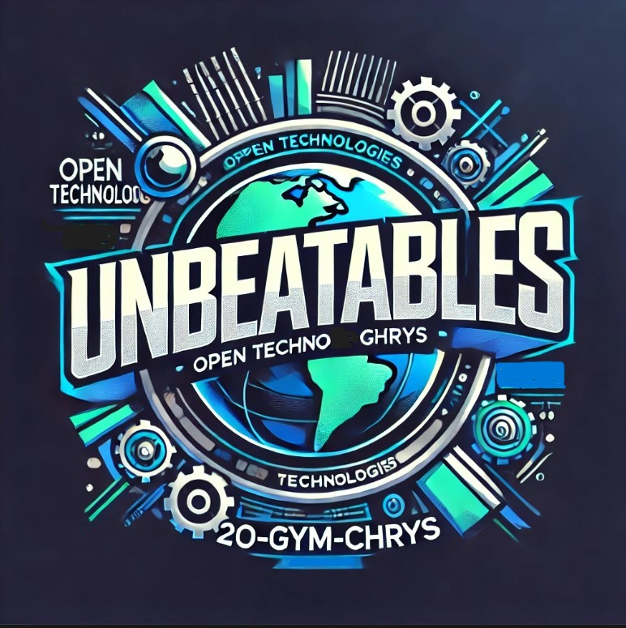

Η ομαδάρα μας ονομάζεται **"UNπαίκτABLES"**

και, επειδή το **"άπαιχτοι"** δεν μπορεί να μεταφραστεί ακριβώς στα αγγλικά, στο λογότυπο μας χρησιμοποιούμε το **"UNBEATABLES"**.
Ο τίτλος του πρότζεκτ μας είναι:

**"Ο ΘΡΟΝΟΣ ΤΟΥ ΛΑΟΥ...Ο ΘΡΟΝΟΣ ΠΟΥ ΜΑΣ ΑΞΙΖΕΙ"**

Ξεκινήσαμε να το συζητάμε στα μέσα του Οκτώβρη. 
Δόθηκε σε μαθητές/μαθήτριες ένα φυλλάδιο με οδηγίες για το διαγωνισμό, για τις δύο θεαματικές ενότητες:

•	Επαναπροσδιορισμός του δημόσιου χώρου

•	Δημιουργία συναισθηματικών δεσμών με τη ρομποτική

Τους ζητήθηκε να τα μελετήσουν καλά και να αποφασίσουν αν είναι έτοιμοι να ξεκινήσουμε αυτό το ταξίδι εξερεύνησης και δημιουργικότητας με στόχο τη διαμόρφωση ενός καλύτερου μέλλοντος για όλους.
Τέλη Οκτωβρίου οι **“UNπαικτABLES”** πήραν τη θέση  τους στον βατήρα εκκίνησης. 

Η ομάδα μας (αλφαβητικά): 

**Αφεντούλης Γιώργος, Ζαχαρίου Δάφνη, Ιωαννίδης Παναγιώτης, Κοτζαπαναγιώτης Αναστάσιος, Μολοχίδου Βασιλική ,Μολοχίδου Χριστίνα, Μπαντάνης Δημήτρης** και υπεύθυνος καθηγητής ο Ξανθόπουλος Γιώργος.

Έτοιμοι!!!

Όλοι είναι μαθητές και μαθήτριες της Γ΄ Γυμνασίου του 2ου Γυμνασίου Χρυσούπολης οι οποίοι, στα πλαίσια του μαθήματος της Τεχνολογίας της Γ΄ Γυμνασίου ΕΡΕΥΝΑ ΚΑΙ ΠΕΙΡΑΜΑΤΙΣΜΟΣ, θα προσπαθήσουν να σας εντυπωσιάσουν.

Χωριστήκαμε σε ομάδες, κάναμε τις έρευνές μας,βάλαμε τη φαντασία μας να δουλέψει  για να δημιουργήσουμε την **UNπαίκτABLE** δημόσια τουαλέτα για το δημόσιο χώρο, για το σχολείο, για το πάρκο. Μια τουαλέτα που είναι σε θέση  να εξασφαλίζει υγιεινή, βιωσιμότητα και να είναι ευχάριστη. Που θα  μπορεί να ανταποκρίνεται στις ανάγκες των παιδιών, ΑΜΕΑ ή ομάδων με διαφορετική ταυτότητα. Μία τουαλέτα που θα  μπορεί να είναι ένα παιχνίδι και ταυτόχρονα ένας χώρος κοινότητας, σεβασμού και ασφάλειας.
Θέλαμε να σχεδιάσουμε μια δημόσια τουαλέτα που να είναι όχι μόνο λειτουργική αλλά και αισθητικά ευχάριστη. Μια τουαλέτα που να ενθαρρύνει τη χρήση της και να συμβάλλει στην αλλαγή της αντίληψης για τους δημόσιους χώρους υγιεινής.
Προσπαθήσαμε με τις ιδέες μας να εξασφαλίσουμε την υγιεινή και τη βιωσιμότητα , χρησιμοποιώντας τεχνολογίες αιχμής και φιλικά προς το περιβάλλον υλικά. Να την κάνουμε  προσβάσιμη σε όλους, ανεξαρτήτως ηλικίας, φύλου ή φυσικής κατάστασης. Να την μετατρέψουμε σε έναν χώρο παιχνιδιού και μάθησης.
Σε ένα χώρο που θα χαίρεσαι να χρησιμοποιείς

**Θέλουμε αυτή η τουαλέτα να γίνει στέκι!**

Να γίνει 

**" Ο ΘΡΟΝΟΣ ΤΟΥ ΛΑΟΥ...Ο ΘΡΟΝΟΣ ΠΟΥ ΜΑΣ ΑΞΙΖΕΙ"**

**Τέθηκαν από την αρχή οι  εκπαιδευτικοί Στόχοι:**

1.	**Ανάπτυξη οικολογικής συνείδησης:** Κατανόηση της σημασίας της βιωσιμότητας και των πράσινων τεχνολογιών στον σχεδιασμό δημόσιων χώρων.
	
2.	**Ενίσχυση της αισθητικής καλλιέργειας:** Καλλιέργεια της ικανότητας να δημιουργούν αισθητικά ευχάριστους και λειτουργικούς χώρους.

3.	**Ανάπτυξη δεξιοτήτων ενσυναίσθησης και συμπερίληψης:** Σχεδιασμός με γνώμονα τις ανάγκες διαφορετικών ομάδων, όπως τα ΑΜΕΑ, τα παιδιά και οι ηλικιωμένοι.

4.	**Εισαγωγή στην υγιεινή και υγεία:** Κατανόηση της σημασίας των υγειονομικών μέτρων σε κοινόχρηστους χώρους και η εφαρμογή τους σε πραγματικές λύσεις.
	
5.	**Ανάπτυξη δεξιοτήτων επίλυσης προβλημάτων:** Αντιμετώπιση πραγματικών προκλήσεων που σχετίζονται με τον σχεδιασμό και τη διαχείριση δημόσιων χώρων.
	
6.	**Καλλιέργεια της ομαδικότητας και της συνεργασίας:** Ενθάρρυνση της ομαδικής δουλειάς και του σεβασμού των απόψεων άλλων μελών της ομάδας.
	
7.	**Ανάπτυξη κριτικής σκέψης:** Διερεύνηση και αξιολόγηση διαφορετικών λύσεων για βιώσιμη χρήση των κοινόχρηστων χώρων.
  
8.	**Προώθηση της ενεργούς συμμετοχής των μαθητών:** Ενθάρρυνση των μαθητών να συμβάλλουν ενεργά στον σχεδιασμό και την υλοποίηση του έργου.
	
9.	**Εξοικείωση με τις τεχνολογίες καθαρισμού και απολύμανσης:** Κατανόηση σύγχρονων τεχνολογιών που εξασφαλίζουν την καθαριότητα και ασφάλεια των χώρων.

10.	**Εκμάθηση διαχείρισης αποβλήτων:** Προώθηση της σημασίας της ανακύκλωσης και της ορθολογικής διαχείρισης των αποβλήτων σε δημόσιους χώρους.
  
11.	**Καλλιέργεια της κοινωνικής ευαισθητοποίησης:** Αναγνώριση της αξίας του δημόσιου χώρου και της σημασίας του για την κοινότητα.
  
12.	**Ανάπτυξη δεξιοτήτων επικοινωνίας:** Παρουσίαση και υπεράσπιση των ιδεών σε άλλους, αναπτύσσοντας τις επικοινωνιακές δεξιότητες των μαθητών.
  
13.	**Ενίσχυση της φαντασίας και δημιουργικότητας:** Σχεδιασμός καινοτόμων και πρωτοποριακών λύσεων για τους δημόσιους χώρους.
  
14.	**Καλλιέργεια του σεβασμού για την ιδιωτικότητα:** Κατανόηση της σημασίας της προστασίας της ιδιωτικότητας σε δημόσιους χώρους και ενσωμάτωση αυτής της αξίας στον σχεδιασμό.
  
15.	**Εκμάθηση της σημασίας του σεβασμού και της ισότητας:** Σχεδιασμός χώρων που είναι προσβάσιμοι και φιλόξενοι για όλους ανεξάρτητα από την ταυτότητά τους.
  
16.	**Προώθηση της χρήσης καινοτόμων υλικών :** Εκμάθηση και πειραματισμός με νέα υλικά και τεχνολογίες που μπορούν να εφαρμοστούν στο έργο.
	
17.	**Κατανόηση του ρόλου της τεχνολογίας στην επίλυση προβλημάτων:** Χρήση τεχνολογικών εργαλείων και λύσεων για τη βελτίωση της ασφάλειας και της ευκολίας των δημόσιων χώρων.
  
18.	**Προώθηση του παιχνιδιού και της μάθησης μέσω της εμπειρίας:** Σχεδιασμός διαδραστικών στοιχείων και παιχνιδιών που συνδυάζουν τον δημόσιο χώρο με το παιχνίδι και τη μάθηση.
  
19.	**Ανάπτυξη δεξιοτήτων προγραμματισμού και αυτοματισμών:** Εκμάθηση βασικών αρχών προγραμματισμού και αυτοματισμών για λειτουργίες, όπως φωτισμός και καθαρισμός με στόχο την αυτοματοποίηση και την ενεργειακή αποδοτικότητα.
    
20.	**Προώθηση της Υπολογιστικής Σκέψης** στους μαθητές/τριες κάθε εκπαιδευτικής βαθμίδας και ειδικότερα στη Δευτεροβάθμια ως εργαλείου επίλυσης και εμβάθυνσης σε προχωρημένα θέματα της επιστήμης των υπολογιστών.
  
21.	**Εξοικείωση  των εκπαιδευτικών και των μαθητών/τριών με σύγχρονα μοντέλα εκπαίδευσης βασισμένα στην προσέγγιση S.T.E.A.M.** (Science, Technology, Engineering, Arts, Mathematics) και στη μαθητοκεντρική προσέγγιση της γνώσης, ώστε να μπουν οι βάσεις για τη δημιουργία ενός ανοικτού περιβάλλοντος ανακαλυπτικής μάθησης που θα δημιουργήσει ενεργούς και δραστήριους πολίτες.
  
22.	**Άνοιγμα του σχολείου  προς την κοινωνία** μέσα από τις δράσεις που θα κληθούν  οι μαθητές να υλοποιήσουν, οι οποίες διερευνούν λύσεις σε προβλήματα του σχολείου τους, της τοπικής οικονομίας ή του γενικότερου κοινωνικού συνόλου.
    

Όλοι οι παραπάνω στόχοι θα επιτευχθούν μέσα από την έρευνα, τη συνεργασία, τον σχεδιασμό ,τον πειραματισμό και τη συνεργασία με φορείς.
Δεν θα πετυχαίναμε τους στόχους που θέσαμε αν επικεντρώναμε την προσοχή μας μόνο σε μία κατασκευή, σε μία ιδέα μας. Προσπαθήσαμε να καλύψουμε σφαιρικά το θέμα και να καλύψουμε όσο το δυνατόν περισσότερες πλευρές του. Να βρούμε όσο το δυνατόν περισσότερες λύσεις  και να τις αναπτύξουμε μέσα στον συγκεκριμένο  χρόνο που μας δίνει ο διαγωνισμός. 
Θα επιδιώξουμε να έρθουμε σε επαφή με την τεχνική υπηρεσία του Δήμου Νέστου, για να πάρουμε πληροφορίες για τις προδιαγραφές που πρέπει να  έχει μία δημόσια τουαλέτα, και με το Κέντρο Υγείας της πόλης μας  για τους κανόνες υγιεινής που πρέπει να τηρούνται κατά το πλύσιμο των χεριών και κατά την χρήση της. 

**ΙΔΕΕΣ ΣΥΜΜΕΤΟΧΗΣ**

ΠΡΟΣΒΑΣΙΜΟΤΗΤΑ

**1.Συσκευή εντοπισμού εμποδίου για άτομα με περιορισμένη όραση**

Προγραμματισμός με αισθητήρα υπερήχων και ενεργοποίηση led και βομβητή μέσα στην τουαλέτα για άτομα με προβλήματα όρασης. Θα την χρησιμοποιούν άτομα με προβλήματα όρασης μέσα στη δημόσια τουαλέτα και, όταν πλησιάζουν σε απόσταση που θα ορίσουμε εμείς, θα ανάβει ένα φωτάκι και θα ηχεί ο βομβητής (μία συσκευή ηχητικών σημάτων) που θα ειδοποιεί το άτομο ότι υπάρχει εμπόδιο μπροστά του.Η συσκευή μπορεί να χρησιμοποιηθεί οπουδήποτε όχι μόνο στην τουαλέτα.

**Υλικά και Κόστος**

1. **Arduino uno** : ~20 €
2. **Αισθητήρας απόστασης-υπερήχων** : ~2 €
3. **LED** : ~ 0,10 €
4. **Αντίσταση** : ~0,05 €
5. **Βομβητής (Buzzer)**: ~1 €
6. **Καλώδια σύνδεσης**: ~1 €
7. **Πηγή τροφοδοσίας (μπαταρία + υποδοχή)**: ~3 € (Για να μειώσουμε το κόστος εναλλακτικά, μπορεί να χρησιμοποιήσουμε τροφοδοσία μέσω USB).

**Σύνολο**: **~ 27 €**

ΔΙΑΣΚΕΔΑΣΗ

**2.Μουσική είσοδος.**

Ένας αισθητήρας κίνησης θα ενεργοποιεί μουσική όταν αντιλαμβάνεται ότι κάποιος/α μπήκε στη δημόσια τουαλέτα. Η μουσική που θα παίζει θα είναι δικά μας τραγούδια, με δικούς μας στίχους που θα δημιουργήσουμε με την Τεχνητή Νοημοσύνη και θα έχουν σχέση με τη χρήση της δημόσιας τουαλέτας.

**Υλικά και Κόστος**

1. **Arduino Uno** : ~20 €.
2. **Αισθητήρας Κίνησης:** ~3 €.
3. **Ηχητικό Μονάδα (MP3 Player Module):** ~7 €.
4. **Ηχείο (μικρό):** ~5 € .
5. **Κάρτα microSD:** ~3€ (για μικρή χωρητικότητα, π.χ. 2–4 GB).
6. **Κατανεμητής Τάσης ή Αντιστάσεις:** ~1 €.
7. **Καλώδια και Συνδέσεις**: ~1 €.
8. **Πηγή τροφοδοσίας (μπαταρία + υποδοχή)**: ~5 € (Για να μειώσουμε το κόστος εναλλακτικά, μπορεί να χρησιμοποιήσουμε τροφοδοσία μέσω USB).

**Σύνολο**: **~ 45 €**

ΑΞΙΟΛΟΓΗΣΗ

**3.Αξιολόγηση της τουαλέτας.**

Θα δημιουργήσουμε ένα online ερωτηματολόγιο για να μπορούν οι χρήστες της δημόσιας τουαλέτας να την αξιολογούν .Θα δημιουργήσουμε ένα qr code με ένα ανοιχτό λογισμικό QR code generator, και θα βάλουμε το ερωτηματολόγιό μας στον κώδικα QR. Θα τοποθετήσουμε ένα αυτοκόλλητο στην πίσω πλευρά της πόρτας της τουαλέτας της δημόσιας τουαλέτας και θα παροτρύνουμε τον κόσμο να σκανάρει και να αξιολογήσει την τουαλέτα. Με αυτόν τον τρόπο θα έχουμε άμεσα κριτικές και θα γνωρίζουμε τα προβλήματα που υπάρχουν ή δημιουργούνται και θα μπορούμε να επεμβαίνουμε αναλόγως.

**Κόστος: 0,1 ευρώ (Η τιμή του αυτοκόλλητου Α4.Θα το φτιάξουμε εμείς)**

ΚΑΘΑΡΙΟΤΗΤΑ

**4.Καταγραφή δεδομένων χρήσης**

Ένας αισθητήρας θα καταγράφει πόσα άτομα χρησιμοποίησαν την τουαλέτα. Τα δεδομένα θα στέλνονται στο προσωπικό καθαριότητας που θα τα αξιοποιεί για να γνωρίζουν αν πρέπει να την καθαρίσουν ή όχι. Σε περιπτώσεις που εισήλθαν περισσότερα άτομα από ό,τι συνήθως θα επεμβαίνουν νωρίτερα.

**Υλικά και Κόστος**

1. **Arduino uno** : ~20 €
2. **Αισθητήρας απόστασης-υπερήχων** : ~2 €
3. **LED (1 τεμ.)**: ~ 0,10 €
4. **Αντίσταση** : ~0,05 €
5. **Βομβητής (Buzzer)**: ~1 €
6. **Καλώδια σύνδεσης**: ~1 €
7. **Πηγή τροφοδοσίας (μπαταρία + υποδοχή)**: ~5 € (Για να μειώσουμε το κόστος εναλλακτικά, μπορεί να χρησιμοποιήσουμε τροφοδοσία μέσω USB).
8. **Wi-Fi Module** 4 €.
9. **Βάση Δεδομένων (Cloud ή Τοπικός Server)** Δωρεάν για βασικές cloud υπηρεσίες.

**Σύνολο**: **~ 33 €**

ΔΙΑΣΚΕΔΑΣΗ

**5.Φωτογραφικός χώρος**

Θα δημιουργήσουμε έναν φωτογραφικό χώρο,έναν «χώρο selfie». Θα δημιουργήσουμε μία εικόνα με κάποιον/α διάσημο/η-καρτούν-υπερήρωα-άγαλμα κτλ με κάποιο εργαλείο ανοιχτού κώδικα και δίπλα του θα υπάρχει το σώμα μίας γυναίκας ή ενός άντρα από το οποίο θα λείπει το πρόσωπο. Θα εκτυπώσουμε την εικόνα, είτε σε αυτοκόλλητο είτε σε μουσαμά έτσι ώστε το ύψος του διάσημου και του ατόμου δίπλα να είναι κοντά σε πραγματικό ύψος και θα φτιάξουμε μία κατασκευή σταθερή για να κολλήσουμε το αυτοκόλλητο ή το μουσαμά. Οι χρήστες τις τουαλέτας θα μπορούν να βγάζουν φωτογραφίες. Αυτό θα μπορεί να δημιουργήσει μια διασκεδαστική εμπειρία. Μπορεί να βάλουμε και αισθητήρα και, όταν κάποιος πλησιάζει αρκετά κοντά, να μιλάει η εικόνα και να τον παροτρύνει να βγάλει φωτογραφία.

Π.χ. Έλα βγάλε μια φωτογραφία. Μην ντρέπεσαι. Δεν είσαι τόσο άσχημος/η.

Έλα να βγούμε μια φωτογραφία και να σε κάνω διάσημη/ο.1000 likes θα πάρεις αν το ανεβάσεις στα social.

**Υλικά και Κόστος**

1. **Arduino Uno** : ~20 €.
2. **Αισθητήρας Κίνησης:** ~3 €.
3. **Ηχητικό Μονάδα (MP3 Player Module):** ~7 €.
4. **Ηχείο (μικρό):** ~5 € .
5. **Κάρτα microSD:** ~3€ (για μικρή χωρητικότητα, π.χ. 2–4 GB).
6. **Κατανεμητής Τάσης ή Αντιστάσεις:** ~1 €.
7. **Καλώδια και Συνδέσεις**: ~1 €.
8. **Πηγή τροφοδοσίας (μπαταρία + υποδοχή)**: ~5 € (Για να μειώσουμε το κόστος εναλλακτικά, μπορεί να χρησιμοποιήσουμε τροφοδοσία μέσω USB).
9. **Αυτοκόλλητο ή μουσαμάς**: ~10 €
 

**Σύνολο**: **~ 55 €**

ΔΙΑΣΚΕΔΑΣΗ

**6.Διαδραστικά Αυτοκόλλητα**

Θα προσαρμόσουμε τις καμπίνες ώστε η κάθε μία να έχει το δικό της θέμα. Θα δημιουργήσουμε δικές μας εικόνες με συγκεκριμένα θέματα με κάποιο εργαλείο ανοιχτού κώδικα.

Παραδείγματα:

**Βιβλιοθήκη** - Ράφια με ψεύτικα βιβλία, επιγραφές από διάσημα βιβλία, και vintage διακόσμηση. Θα φτιάξουμε qr code με ένα ανοιχτό λογισμικό QR code generator, που όταν το σκανάρεις θα παραπέμπει σε κάποιο ανοιχτό-δωρεάν βιβλίο ή σε επιλογές για βιβλία –κόμικ –ποιήματα. **Openbook.gr**

**Κινηματογράφος** - Πόστερ από κλασικές ταινίες, καθίσματα τύπου σινεμά και φωτιστικά σε στυλ κινηματογράφου. Θα φτιάξουμε qr code με ένα ανοιχτό λογισμικό QR code generator, που όταν το σκανάρεις θα παραπέμπει σε κάποιο ατάκες του ελληνικού ή ξένου κινηματογράφου.

**Αρχαιολογικό Μουσείο** \- Με αγάλματα, αγγεία κτλ κομψή διακόσμηση και περιβάλλον που θυμίζει αίθουσα μουσείου. Θα φτιάξουμε qr code με ένα ανοιχτό λογισμικό QR code generator, που όταν το σκανάρεις θα παραπέμπει σε φωτογραφίες από αρχαιολογικά μουσεία της Ελλάδας. Θα ήταν ιδανικό για τους τουρίστες που επισκέπτονται τη χώρα μας.

**_Σε παιδικές τουαλέτες_**

**Εικόνες από ήρωες κόμικς.** Θα φτιάξουμε qr code με ένα ανοιχτό λογισμικό QR code generator, που όταν το σκανάρεις θα παραπέμπει στο στον ήρωα και θα μπορούν να δουν πληροφορίες για το κόμικ ή να το διαβάσουν online κάποιο τεύχος.

Θα δημιουργήσουμε κάποια από τα παραπάνω παραδείγματα.

**Κόστος: 10 ευρώ (Η τιμή του έγχρωμου αυτοκόλλητου)**

ΔΙΑΣΚΕΔΑΣΗ

**7.Καθρέφτη καθρεφτάκι μου**

2  καθρέφτες στη σειρά.Με αισθητήρα όταν κάποιος πλησιάζει τον καθρέφτη αυτός θα του μιλάει. π.χ. :

_Καθρέφτης 1:_ Μάλλον θέλεις να σου πω αν υπάρχει πιο ωραίο πλάσμα από εσένα στον κόσμο.Μόνο σήμερα πέρασαν καμιά 50 πιο ωραία πλάσματα από εσένα. Ρώτησε τον διπλανό καθρέφτη μήπως σου πει κάτι άλλο.

_Καθρέφτης 2:_ Μην με ρωτήσεις αν υπάρχει πιο ωραίο πλάσμα από εσένα γιατί θα λέω ονόματα τουλάχιστον για δύο ώρες. Ρώτησε τον διπλανό καθρέφτη μήπως σου πει άλλα.

**Υλικά και Κόστος**

1. **Arduino Uno** : ~20 €.
2. **Αισθητήρας Κίνησης:** ~3 €.
3. **Ηχητικό Μονάδα (MP3 Player Module):** ~7 €.
4. **Ηχείο (μικρό):** ~5 € .
5. **Κάρτα microSD:** ~3€ (για μικρή χωρητικότητα, π.χ. 2–4 GB).
6. **Κατανεμητής Τάσης ή Αντιστάσεις:** ~1 €.
7. **Καλώδια και Συνδέσεις**: ~1 €.
8. **Πηγή τροφοδοσίας (μπαταρία + υποδοχή)**: ~5 € (Για να μειώσουμε το κόστος εναλλακτικά, μπορεί να χρησιμοποιήσουμε τροφοδοσία μέσω USB).
9. **Καθρέφτης (έχουμε)**

**Σύνολο**: **~ 45 €**

ΠΑΙΧΝΙΔΙΑ

**8.Παιχνίδι με Ερωτήσεις - Καρτέλες Υγιεινής**

Θα δημιουργήσουμε παιχνίδια ερωτήσεων-κουΐζ, σταυρόλεξα, κρυπτόλεξα κτλ. με εφαρμογές ανοιχτού κώδικα.Τα παιχνίδια θα περιέχουν ερωτήσεις και απαντήσεις σχετικά με την υγιεινή και λέξεις σχετικά με μια δημόσια τουαλέτα. Θα φτιάξουμε qr code με ένα ανοιχτό λογισμικό QR code generator, που όταν το σκανάρεις θα παραπέμπει στο παιχνίδι.Θα τοποθετήσουμε ένα αυτοκόλλητο στην πίσω πλευρά της πόρτας της τουαλέτας της δημόσιας τουαλέτας ή σε κάποιο άλλο εμφανές σημείο της και θα παροτρύνουμε τα παιδιά να σκανάρουν και να παίξουν.Τα παιχνίδια θα μπορούσαν να χρησιμοποιηθούν και από τους καθηγητές ή τους δασκάλους τις ώρες μαθημάτων σε μαθήματα που σχετίζονται με την υγιεινή.

**Κόστος: 0,1 ευρώ (Η τιμή του αυτοκόλλητου Α4.Θα το φτιάξουμε εμείς).**

ΠΑΙΧΝΙΔΙΑ

**9.Επιτραπέζιο παιχνίδι για την τουαλέτα στο σχολείο**

Θα φτιάξουμε μόνοι μας ένα τελείως καινούργιο επιτραπέζιο παιχνίδι με πούλια, κάρτες και ζάρια που θα έχει σχέση με την τουαλέτα του σχολείου. Θα περιέχει και διαδραστικό κουΐζ με ερωτήσεις για την υγιεινή στο χώρο της τουαλέτας το οποίο θα δημιουργηθεί με ανοιχτού κώδικα εφαρμογή. Θα φτιάξουμε qr code με ένα ανοιχτό λογισμικό QR code generator, που όταν το σκανάρεις θα παραπέμπει στις ερωτήσεις που πρέπει να απαντήσουν οι παίκτες.

**Κόστος : 3 ευρώ Η εκτύπωση του ταμπλό και των καρτών του παιχνιδιού σε χοντρό χαρτόνι**

ΑΣΦΑΛΕΙΑ

**10.Εκτυπώσιμες Πινακίδες Διαφυγής με QR Κώδικες**

Για περιπτώσεις πυρκαγιάς ή σεισμού. 

Κωδικοί QR με ένα ανοιχτό λογισμικό QR code generator που όταν σκαναριστούν, παρέχουν λεπτομέρειες για τις διαδρομές διαφυγής και τις οδηγίες έκτακτης ανάγκης.

**Κόστος: 0,1 ευρώ (Η τιμή του αυτοκόλλητου Α4.Θα το φτιάξουμε εμείς).**

ΑΣΦΑΛΕΙΑ

**11.Εκτυπώσιμες Πινακίδες με οδηγίες για πρώτες βοήθειες με QR Κώδικες**

Για περιπτώσεις σεισμού πυρκαγιάς ή ατυχήματος από άλλα αίτια.

Κωδικοί QR με ένα ανοιχτό λογισμικό QR code generator, που όταν σκαναριστούν, παρέχουν λεπτομέρειες για τις πρώτες βοήθειες και τηλέφωνα έκτακτης ανάγκης αστυνομία, εκάβ, πυροσβεστική κτλ.

**Κόστος: 0,1 ευρώ (Η τιμή του αυτοκόλλητου Α4.Θα το φτιάξουμε εμείς).**

ΑΝΑΚΥΚΛΩΣΗ-ΚΟΜΠΟΣΤΟΠΟΙΗΣΗ

**12.Κάδος για Οικολογικές Εναλλακτικές.**

Θα τοποθετήσουμε μέσα στην τουαλέτα κάδο για την κομποστοποίηση οργανικών απορριμμάτων, όπως χαρτοπετσέτες , συμβάλλοντας έτσι σε έναν πιο ολοκληρωμένο οικολογικό κύκλο. Κωδικός QR με ένα ανοιχτό λογισμικό QR code generator, που όταν το σκανάρεις που θα παρέχει λεπτομέρειες και πληροφορίες για τα πλεονεκτήματα της κομποστοποίησης.

**Κόστος: 1 ευρώ (Η τιμή του αυτοκόλλητου Α4.Θα το φτιάξουμε εμείς) και 2 ευρώ ο κάδος.**

ΑΝΑΚΥΚΛΩΣΗ-ΚΟΜΠΟΣΤΟΠΟΙΗΣΗ

**13.Κομποστοποιητής με μετρητή υγρασίας**

Ένας κομποστοποιητής με μετρητή υγρασίας (με πλακέτα arduino και Αισθητήρα υγρασίας εδάφους και **Οθόνη LCD** για εμφάνιση της υγρασίας) είναι ένα χρήσιμο εργαλείο για τη δημιουργία ποιοτικού κομπόστ, εξασφαλίζοντας ότι οι συνθήκες μέσα στον κάδο είναι ιδανικές για τη διάσπαση των οργανικών υλικών.

**Κόστος:**

**Πλαστικό δοχείο με καπάκι**:6ευρώ

**Ξύλα για την κατασκευή:** 5 ευρώ

**Arduino Uno** (ή άλλη πλακέτα Arduino) ~20€.

**Αισθητήρας υγρασίας εδάφους** ~2€.

**Καλώδια σύνδεσης** (jumper wires) ~1€.

**Οθόνη LCD** για εμφάνιση της υγρασίας ~4€.

**Κόστος ~38€**

**Το συνολικό κόστος και για τις 13 ιδέες μας, με όλα τα υλικά που χρειάζονται, εκτιμάται γύρω στα 258 ευρώ (λαμβάνοντας υπόψη τις πιο χαμηλές τιμές που βρήκαμε στην αγορά).**

Επειδή όμως πολλά από τα στοιχεία που χρειαζόμαστε επαναλαμβάνονται, για να τα φτιάξουμε εμείς και να τα παρουσιάσουμε όλα, θα χρειαστούμε μόνο τα παρακάτω υλικά :

1. **Arduino uno** : ~20 €
   
2. **Αισθητήρας απόστασης-υπερήχων** : ~2 €
   
3. **LED** : ~ 0,10 €
   
4. **Αντίσταση** : ~0,05 €
   
5. **Βομβητής (Buzzer)**: ~1 €
    
6. **Καλώδια σύνδεσης**: ~1 €
    
7. **Πηγή τροφοδοσίας (μπαταρία + υποδοχή)**: ~3 € (Για να μειώσουμε το κόστος εναλλακτικά, μπορεί να χρησιμοποιήσουμε τροφοδοσία μέσω USB).
    
8. **Αισθητήρας Κίνησης:** ~3 €
    
9. **Ηχητικό Μονάδα (MP3 Player Module):** ~7 €
    
10. **Ηχείο (μικρό):** ~5 € 
    
11. **Κάρτα microSD:** ~3€ (για μικρή χωρητικότητα, π.χ. 2–4 GB)
    
12. **Κατανεμητής Τάσης ή Αντιστάσεις:** ~1 €
    
13. **Wi-Fi Module** 4 €
    
14. **Αισθητήρας υγρασίας εδάφους** ~2€
    
15. **Οθόνη LCD** για εμφάνιση της υγρασίας ~4€
    
    

**To κόστος των παραπάνω υλικών υπολογίζεται στα 57 ευρώ.**

Αυτοκόλλητα, κάδο, μουσαμά, ξύλα, πλαστικό δοχείο με καπάκι, χαρτόνι για το επιτραπέζιο, καθρέφτες υπάρχουν στο σχολείο και δεν τα κοστολογήσαμε.

Αυτές είναι οι ιδέες και οι προτάσεις μας και δεσμευόμαστε ότι θα έχουμε έτοιμες τουλάχιστον 10 από τις 13 (Λόγω των παρατάσεων που πήρε η τελική προθεσμία για τις δηλώσεις συμμετοχής στον 7ο Πανελλήνιο Διαγωνισμό Ανοιχτών Τεχνολογιών στην Εκπαίδευση,ο χρόνος που μας απομενει είναι αρκετά μικρός για όλες τις ίδέες μας).
Θα καταβάλουμε όμως κάθε δυνατή προσπάθεια  να τις υλοποιήσουμε όλες μέχρι το Μάιο.

Θα φτιάξουμε την καλύτερη δημόσια τουαλέτα, επειδή μπορούμε και επειδή είμαστε …

**UNπαικτABLES**

)

ΠΑΡΟΥΣΙΑΣΗ UNBEATABLES.mp4

**Υ.Γ.** Δεσμευόμαστε ότι με την ολοκλήρωση του έργου τους θα παραδώσουμε αναλυτικές οδηγίες κατασκευής με βάση το OER Canvas, για να μπορεί το έργο μας να είναι επαναχρησιμοποιήσιμο και από άλλα σχολεία.

Ο κώδικας που θα χρησιμοποιηθεί θα διανέμεται με άδεια χρήσης ανοιχτού κώδικα.

Το εκπαιδευτικό υλικό και η τεκμηρίωση θα διανέμεται με άδεια χρήσης CC-BY.

